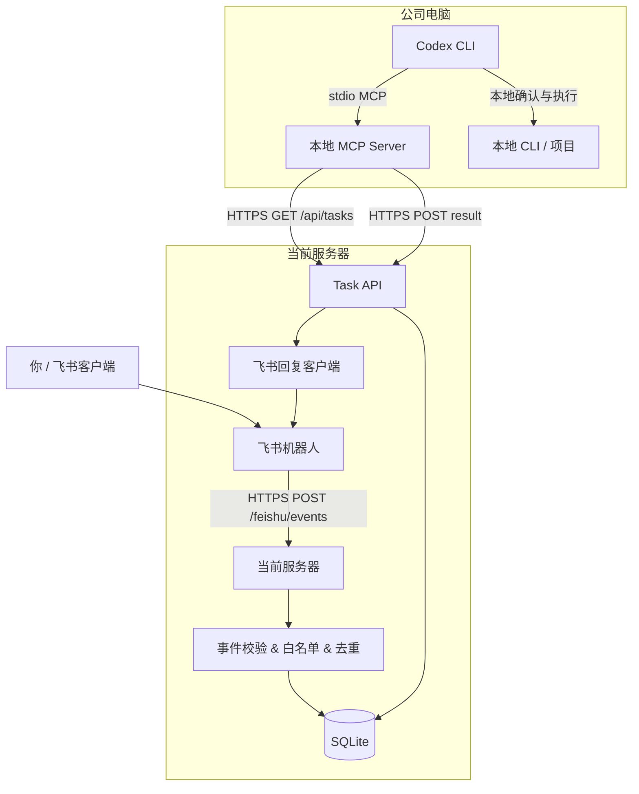
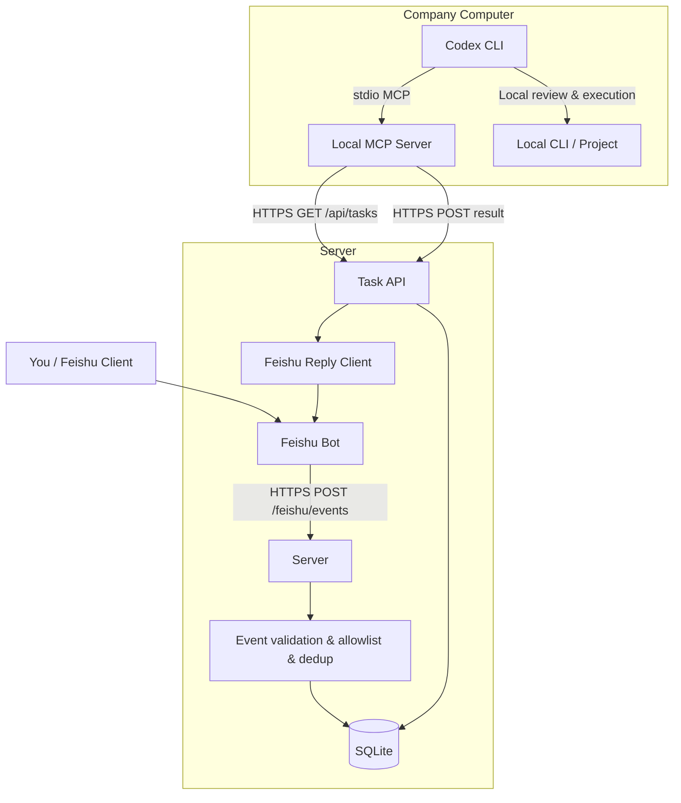

# harness-remote

中文 | [English](#english)

[](#功能概览)
[](#适用前提)
[](#架构)
[](#许可证)

> 通过飞书收集远程任务，让公司电脑上的 Codex CLI 通过本地 MCP 主动拉取并回传结果。
> Feishu task inbox for local Codex CLI, powered by MCP, without a background remote-control agent.

[功能概览](#功能概览) · [架构](#架构) · [快速开始](#快速开始) · [开发文档](docs/DEVELOPMENT.md) · [API 参考](#api-参考) · [MCP 工具](#mcp-工具) · [部署](#部署) · [测试](#测试) · [FAQ](#常见问题)

> [!IMPORTANT]
> 本项目的边界是"远程任务协作"，不是"远程控制公司电脑"。公司电脑不运行后台 agent，不暴露端口，也不会被当前服务器主动唤醒或控制。

## 功能概览

| 能力 | 状态 | 说明 |
| --- | --- | --- |
| 飞书消息入口 | ✅ 已实现 | 接收机器人消息事件并创建任务 |
| 用户白名单 | ✅ 已实现 | 只允许指定飞书用户创建任务 |
| 事件去重 | ✅ 已实现 | SQLite 记录已处理事件，防止重复创建 |
| 任务 API | ✅ 已实现 | 查询任务、更新状态、上报结果 |
| SQLite 持久化 | ✅ 已实现 | 任务与事件去重记录持久存储 |
| 本地 MCP Server | ✅ 已实现 | 由 Codex CLI 启动，通过 HTTPS 访问服务器 |
| MCP 工具 | ✅ 已实现 | list_tasks / get_task / mark_task_running / report_task_result / reply_feishu |
| 飞书结果回复 | ✅ 已实现 | 将本地处理结果回复到原飞书会话 |
| 单元与集成测试 | ✅ 已实现 | 5 个测试套件，覆盖全链路 |
| 部署脚本 | ✅ 已实现 | 一键构建 + systemd 服务安装 |
| 后台远控 agent | ❌ 不做 | 不在公司电脑上运行常驻远控进程 |
| 自动执行命令 | ❌ 不做 | 飞书消息不会直接执行本地命令 |

## 架构



核心约束：
- 飞书只负责消息入口和结果展示。
- 当前服务器只保存任务、鉴权、调用飞书 API。
- 公司电脑只在你主动打开 Codex CLI 后，通过 MCP 主动访问当前服务器。
- MCP 只用于本地 Codex CLI 工具扩展，不承担公网穿透或远程唤醒。

## 快速开始

### 1. 服务器部署

```bash
git clone https://github.com/Bigheadh/harness-remote.git
cd harness-remote
npm install
npm run build
```

创建配置文件：

```bash
cp config/server.example.json config/server.json
```

编辑 `config/server.json`：

```json
{
  "port": 3000,
  "publicBaseUrl": "https://your-server-domain.com",
  "personalToken": "生成一个随机字符串作为 API 认证 token",
  "storagePath": "./data/tasks.sqlite",
  "feishu": {
    "appId": "cli_xxx",
    "appSecret": "你的飞书应用 Secret",
    "verificationToken": "你的飞书事件验证 Token",
    "encryptKey": "你的飞书事件加密 Key（可选，留空则不解密）",
    "allowedUserIds": ["ou_xxx"]
  }
}
```

启动服务：

```bash
npm run server
# 或使用部署脚本安装 systemd 服务：
# bash scripts/deploy.sh --install-service --service-user root
```

服务器需要通过 HTTPS 反向代理暴露：

```text
https://your-server-domain.com/feishu/events
```

### 2. 飞书配置

1. 在 [飞书开放平台](https://open.feishu.cn/) 创建企业自建应用。
2. 启用「机器人」能力。
3. 在「事件订阅」中添加：`im.message.receive_v1`。
4. 设置请求地址为 `https://your-server-domain.com/feishu/events`。
5. 将机器人的 App ID、App Secret、Verification Token 和 Encrypt Key 填入 `config/server.json`。
6. 在 `allowedUserIds` 中添加你的飞书用户 ID（格式 `ou_xxx`，可在飞书开放平台「权限管理」中查看）。

### 3. 公司电脑配置

```bash
git clone https://github.com/Bigheadh/harness-remote.git
cd harness-remote
npm install
npm run build
```

创建配置文件：

```bash
cp config/mcp.example.json config/mcp.json
```

编辑 `config/mcp.json`：

```json
{
  "serverBaseUrl": "https://your-server-domain.com",
  "personalToken": "与 config/server.json 中相同的 personalToken",
  "defaultUser": "me"
}
```

在 Codex CLI 的 MCP 配置中添加：

```toml
[mcp_servers.harness_remote]
command = "node"
args = ["/path/to/harness-remote/dist/mcp-server/index.js", "--config", "/path/to/harness-remote/config/mcp.json"]
```

### 4. 使用流程

1. 在飞书中给机器人发消息（任务描述）。
2. 服务器接收并存储为 `pending` 任务。
3. 在公司电脑上打开 Codex CLI。
4. Codex CLI 调用 MCP 工具 `list_tasks` 获取待处理任务。
5. 查看任务详情（`get_task`），标记为 running（`mark_task_running`）。
6. 本地处理完成后，调用 `report_task_result` 上报结果。
7. 服务器自动将结果回复到原飞书会话。

## API 参考

所有 API 请求需要在 Header 中携带 Bearer token：

```bash
Authorization: Bearer <personalToken>
```

### 健康检查

```bash
GET /health
```

响应：`{ "ok": true }`

### 列出任务

```bash
GET /api/tasks?status=pending&limit=10
```

参数：
- `status` — 按状态过滤（`pending` / `picked` / `running` / `done` / `failed`）
- `limit` — 返回数量上限（默认 50）

### 获取任务详情

```bash
GET /api/tasks/:id
```

### 更新任务状态

```bash
POST /api/tasks/:id/status
Content-Type: application/json

{ "status": "running" }
```

状态流转规则：`pending → picked → running → done/failed`。

### 上报任务结果

```bash
POST /api/tasks/:id/result
Content-Type: application/json

{
  "status": "done",
  "resultSummary": "已完成代码审查",
  "resultDetails": "发现 3 个潜在问题..."
}
```

上报成功后，服务器会自动调用飞书 API 将结果回复到原会话。

## MCP 工具

本地 MCP Server 提供以下 5 个工具，供 Codex CLI 在会话中调用：

| 工具 | 说明 |
| --- | --- |
| `list_tasks` | 列出待处理任务（支持按 status 过滤） |
| `get_task` | 获取单个任务详情 |
| `mark_task_running` | 将任务标记为 running |
| `report_task_result` | 上报处理结果并自动回复飞书 |
| `reply_feishu` | 直接回复飞书消息（不需要先有任务） |

## 部署

### 手动部署

```bash
cd harness-remote
npm install --omit=dev
npm run build
npm run server
```

### systemd 服务（推荐）

```bash
bash scripts/deploy.sh --install-service --service-user root
```

这会：
1. 安装生产依赖
2. 构建 TypeScript
3. 创建数据目录
4. 安装 systemd 服务文件到 `/etc/systemd/system/harness-remote.service`
5. 启动服务

### HTTPS 反向代理

服务器必须通过 HTTPS 暴露。推荐使用 nginx 反向代理：

```nginx
server {
    listen 443 ssl;
    server_name your-server-domain.com;

    ssl_certificate /path/to/cert.pem;
    ssl_certificate_key /path/to/key.pem;

    location / {
        proxy_pass http://127.0.0.1:3000;
        proxy_set_header Host $host;
        proxy_set_header X-Real-IP $remote_addr;
    }
}
```

## 测试

```bash
npm run test
```

测试套件：
- `test/shared/http.test.ts` — Bearer token 验证
- `test/server/tasks.store.test.ts` — SQLite CRUD、状态机流转
- `test/server/feishu.events.test.ts` — 事件解析、白名单、去重、群聊 mention
- `test/mcp-server/tools.test.ts` — MCP 工具契约
- `test/server/integration.test.ts` — 端到端集成测试

## 适用前提

- 你可以管理一台当前服务器，并为它配置公网 HTTPS。
- 你可以在飞书开放平台创建或配置自建机器人。
- 公司电脑允许安装和使用 Codex CLI。
- 公司电脑允许 Codex CLI 启动本地 MCP server。
- 公司电脑不允许或不适合安装后台远控 agent。

## 通信边界

| 方向 | 协议 | 发起方 | 常驻 | 说明 |
| --- | --- | --- | --- | --- |
| 飞书 -> 当前服务器 | HTTPS | 飞书开放平台 | 否 | 事件回调，需公网 HTTPS |
| 本地 MCP -> 当前服务器 | HTTPS | 公司电脑本地 MCP | 否 | Codex CLI 会话内主动请求 |
| 当前服务器 -> 飞书 | HTTPS | 当前服务器 | 否 | 调用飞书 API 回复 |
| 当前服务器 -> 公司电脑 | 无 | — | — | 不存在该通道 |

## 项目结构

```text
harness-remote/
  config/
    server.example.json    # 服务器配置模板
    mcp.example.json       # MCP 配置模板
  docs/
    DEVELOPMENT.md         # 完整开发文档
  scripts/
    deploy.sh              # 部署脚本 + systemd 安装
  src/
    server/
      config.ts            # 服务器配置加载与校验
      index.ts             # Fastify 服务器启动
      feishu/
        client.ts          # 飞书 API 客户端（token 获取、消息回复）
        events.ts          # 飞书事件处理（签名验证、解密、去重、任务创建）
      tasks/
        store.ts           # SQLite 任务存储
        routes.ts          # Task API 路由（health、tasks CRUD）
    mcp-server/
      config.ts            # MCP 配置加载
      index.ts             # MCP Server 启动（stdio transport）
      client.ts            # HTTP 客户端（调用服务器 API）
      tools.ts             # MCP 工具定义（5 个工具）
    shared/
      errors.ts            # AppError 错误类
      http.ts              # Bearer token 验证辅助
      types.ts             # 共享类型定义
  test/
    shared/http.test.ts
    server/tasks.store.test.ts
    server/feishu.events.test.ts
    server/integration.test.ts
    mcp-server/tools.test.ts
  FEATURES.md              # 功能追踪
  README.md
```

## 它不是什么

- 不是远程桌面。
- 不是远程 shell。
- 不是公司电脑后台 agent。
- 不是绕过公司安全策略的远控工具。
- 不是让飞书消息直接执行公司电脑命令的自动化系统。

## 常见问题

### 可以只在公司电脑安装 MCP，不装 agent 吗？

可以。这个项目的设计就是只让 Codex CLI 启动本地 MCP server，不安装后台 remote-agent。

### 飞书消息会自动执行公司电脑命令吗？

不会。飞书消息只会在服务器上生成任务。只有你在公司电脑本地打开 Codex CLI，并让它通过 MCP 拉取任务后，才会进入本地处理流程。

### 当前服务器能主动控制公司电脑吗？

不能。公司电脑不暴露端口，服务器也没有到公司电脑的连接通道。

### 如果 Codex CLI 没有打开会怎样？

任务会保存在服务器上，保持 `pending` 状态。等你本地打开 Codex CLI 并调用 MCP 工具后再处理。

### 为什么不用 WebSocket 长连接 agent？

因为你的约束是不希望在公司电脑上安装或运行远控类后台进程。MCP 拉取模型牺牲自动化，换来更清晰的本地人工确认边界。

## 文档

- [完整开发文档](docs/DEVELOPMENT.md)

## 许可证

许可证暂未确定。正式发布前会补充 `LICENSE` 文件。

---

## English

[中文](#harness-remote) | English

[](#overview)
[](#preconditions)
[](#architecture)
[](#license)

> A Feishu task inbox for local Codex CLI. Tasks are pulled through a local MCP server only when you explicitly start Codex CLI on the company computer.

[Overview](#overview) · [Architecture](#architecture) · [Quick Start](#quick-start) · [Development Guide](docs/DEVELOPMENT.md) · [API Reference](#api-reference) · [MCP Tools](#mcp-tools) · [Deployment](#deployment) · [Tests](#tests) · [FAQ](#faq)

> [!IMPORTANT]
> This project is about remote task collaboration, not remote control. The company computer runs no background agent, exposes no ports, and cannot be woken up or controlled by the server.

## Overview

| Capability | Status | Notes |
| --- | --- | --- |
| Feishu message entrypoint | ✅ Implemented | Receive bot message events and create tasks |
| User allowlist | ✅ Implemented | Only specified Feishu users can create tasks |
| Event deduplication | ✅ Implemented | SQLite tracks processed events to prevent duplicates |
| Task API | ✅ Implemented | Query tasks, update status, and report results |
| SQLite persistence | ✅ Implemented | Tasks and dedup records persist to disk |
| Local MCP Server | ✅ Implemented | Started by Codex CLI, calls the server over HTTPS |
| MCP tools | ✅ Implemented | list_tasks / get_task / mark_task_running / report_task_result / reply_feishu |
| Feishu result replies | ✅ Implemented | Reply local handling results to the original chat |
| Unit & integration tests | ✅ Implemented | 5 test suites covering the full lifecycle |
| Deploy script | ✅ Implemented | One-click build + systemd service installation |
| Background remote-control agent | ❌ Not planned | No persistent agent on the company computer |
| Automatic command execution | ❌ Not planned | Feishu messages do not directly execute local commands |

## Architecture



Core boundaries:
- Feishu is only the message entrypoint and result display surface.
- The server stores tasks, checks authorization, and calls Feishu APIs.
- The company computer only calls the server after you explicitly start Codex CLI locally.
- MCP is only a local Codex CLI tool extension, not a tunneling or remote wake-up mechanism.

## Quick Start

### 1. Server Setup

```bash
git clone https://github.com/Bigheadh/harness-remote.git
cd harness-remote
npm install
npm run build
```

Create the config:

```bash
cp config/server.example.json config/server.json
```

Edit `config/server.json`:

```json
{
  "port": 3000,
  "publicBaseUrl": "https://your-server-domain.com",
  "personalToken": "a-random-string-for-api-auth",
  "storagePath": "./data/tasks.sqlite",
  "feishu": {
    "appId": "cli_xxx",
    "appSecret": "your-feishu-app-secret",
    "verificationToken": "your-feishu-event-verification-token",
    "encryptKey": "your-feishu-event-encrypt-key",
    "allowedUserIds": ["ou_xxx"]
  }
}
```

Start the server:

```bash
npm run server
# Or install as systemd service:
# bash scripts/deploy.sh --install-service --service-user root
```

Expose via HTTPS reverse proxy (nginx recommended).

### 2. Feishu Setup

1. Create a custom app on the [Feishu Open Platform](https://open.feishu.cn/).
2. Enable the Bot capability.
3. Subscribe to event: `im.message.receive_v1`.
4. Set the callback URL to `https://your-server-domain.com/feishu/events`.
5. Add App ID, App Secret, Verification Token, and Encrypt Key to `config/server.json`.
6. Add your Feishu user ID to `allowedUserIds`.

### 3. Company Computer Setup

```bash
git clone https://github.com/Bigheadh/harness-remote.git
cd harness-remote
npm install
npm run build
```

Create the config:

```bash
cp config/mcp.example.json config/mcp.json
```

Edit `config/mcp.json`:

```json
{
  "serverBaseUrl": "https://your-server-domain.com",
  "personalToken": "same-token-as-server-config",
  "defaultUser": "me"
}
```

Add to Codex CLI MCP configuration:

```toml
[mcp_servers.harness_remote]
command = "node"
args = ["/path/to/harness-remote/dist/mcp-server/index.js", "--config", "/path/to/harness-remote/config/mcp.json"]
```

### 4. Usage Flow

1. Send a message to the Feishu bot (task description).
2. Server receives and stores it as a `pending` task.
3. Open Codex CLI on the company computer.
4. Codex CLI calls MCP tool `list_tasks` to get pending tasks.
5. View task details (`get_task`), mark as running (`mark_task_running`).
6. After handling, call `report_task_result` to submit the result.
7. Server automatically replies to the original Feishu conversation.

## API Reference

All API requests require a Bearer token in the header:

```bash
Authorization: Bearer <personalToken>
```

### Health Check

```bash
GET /health
```

Response: `{ "ok": true }`

### List Tasks

```bash
GET /api/tasks?status=pending&limit=10
```

### Get Task

```bash
GET /api/tasks/:id
```

### Update Status

```bash
POST /api/tasks/:id/status
Content-Type: application/json

{ "status": "running" }
```

### Report Result

```bash
POST /api/tasks/:id/result
Content-Type: application/json

{
  "status": "done",
  "resultSummary": "Code review completed",
  "resultDetails": "Found 3 potential issues..."
}
```

## MCP Tools

| Tool | Description |
| --- | --- |
| `list_tasks` | List pending tasks (filter by status) |
| `get_task` | Get task details |
| `mark_task_running` | Mark task as running |
| `report_task_result` | Report result and auto-reply to Feishu |
| `reply_feishu` | Reply directly to Feishu (no task required) |

## Deployment

### Quick Deploy

```bash
bash scripts/deploy.sh --install-service --service-user root
```

### Manual

```bash
npm install --omit=dev
npm run build
npm run server
```

### HTTPS

Must expose via HTTPS. Example nginx config:

```nginx
server {
    listen 443 ssl;
    server_name your-domain.com;
    ssl_certificate /path/to/cert.pem;
    ssl_certificate_key /path/to/key.pem;
    location / {
        proxy_pass http://127.0.0.1:3000;
        proxy_set_header Host $host;
    }
}
```

## Tests

```bash
npm run test
```

5 test suites: shared/http, server/tasks.store, server/feishu.events, server/integration, mcp-server/tools.

## Preconditions

- You can manage a server and expose it through public HTTPS.
- You can create or configure a custom Feishu bot.
- The company computer is allowed to use Codex CLI with a local MCP server.
- The company computer does not allow, or is not suitable for, a background remote-control agent.

## Communication Boundaries

| Direction | Protocol | Initiator | Persistent | Notes |
| --- | --- | --- | --- | --- |
| Feishu -> server | HTTPS | Feishu Open Platform | No | Event callback, requires public HTTPS |
| Local MCP -> server | HTTPS | Company computer MCP | No | Active requests inside a Codex CLI session |
| Server -> Feishu | HTTPS | Server | No | Calls Feishu APIs to reply |
| Server -> company computer | None | — | — | This channel does not exist |

## Project Layout

```text
harness-remote/
  config/           # Config templates
  docs/             # Development docs
  scripts/          # Deploy scripts
  src/
    server/         # Fastify server, Feishu events, Task API, SQLite store
    mcp-server/     # MCP server with 5 tools
    shared/         # Types, errors, auth helpers
  test/             # 5 test suites
  FEATURES.md       # Feature tracker
  README.md
```

## FAQ

### Can this work with only MCP on the company computer and no agent?
Yes. The design uses a local MCP server launched by Codex CLI. No background remote-agent.

### Will Feishu messages automatically execute commands on the company computer?
No. Feishu messages only create tasks on the server. Local handling starts only after you open Codex CLI and use MCP tools.

### Can the server actively control the company computer?
No. The company computer exposes no ports, and the server has no connection channel into it.

### What happens if Codex CLI is not open?
Tasks stay on the server as `pending` until you open Codex CLI locally and fetch them through MCP.

### Why not use a WebSocket agent?
Because the constraint is to avoid a background remote-control process on the company computer. The MCP pull model trades automation for a clearer local confirmation boundary.

## License

The license is not decided yet. A `LICENSE` file will be added before a formal release.
