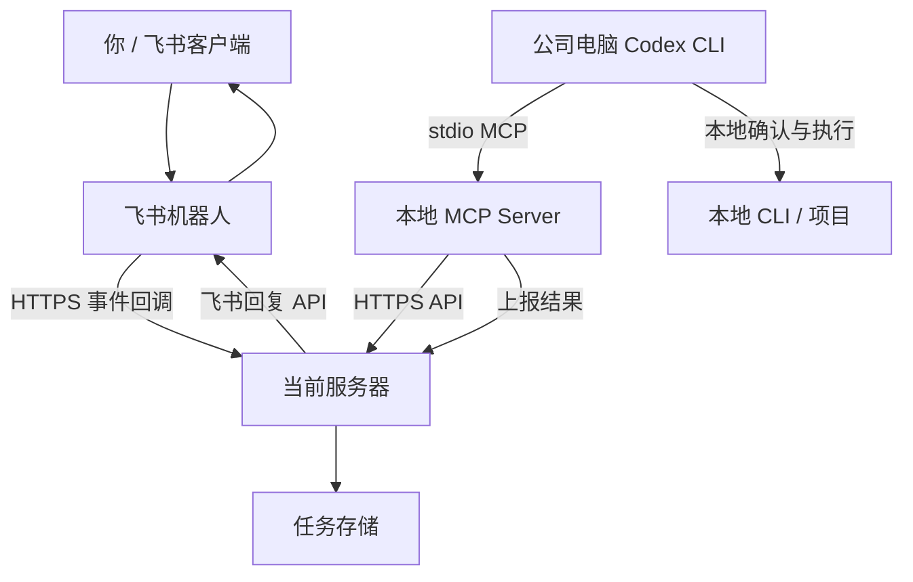
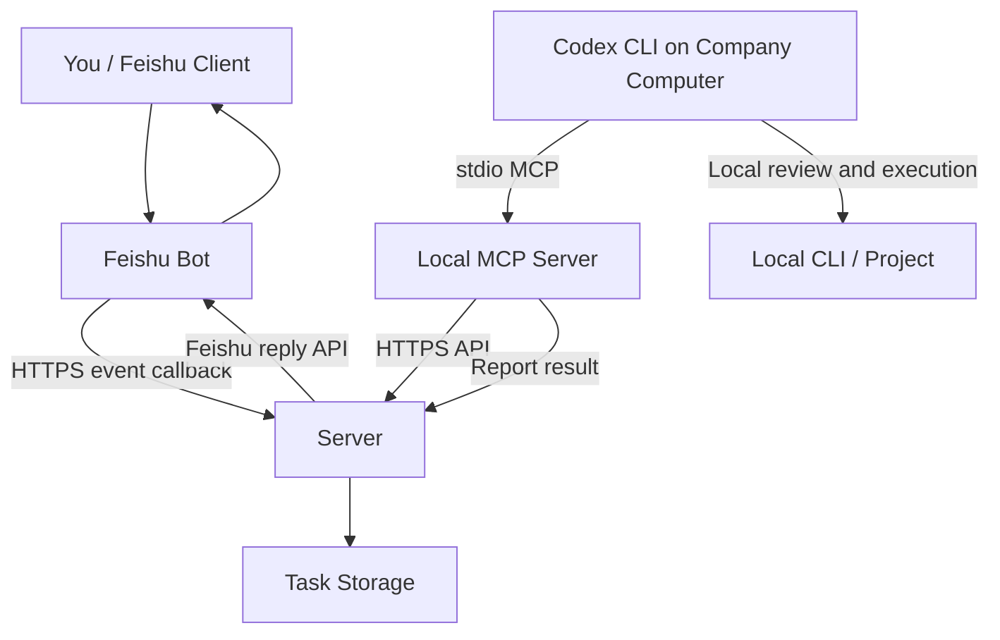

# harness-remote

中文 | [English](#english)

[](#功能规划)
[](#适用前提)
[](#架构)
[](#许可证)

> 通过飞书收集远程任务，让公司电脑上的 Codex CLI 通过本地 MCP 主动拉取并回传结果。  
> Feishu task inbox for local Codex CLI, powered by MCP, without a background remote-control agent.

[项目定位](#项目定位) · [功能规划](#功能规划) · [架构](#架构) · [快速开始](#快速开始规划) · [开发文档](docs/DEVELOPMENT.md) · [FAQ](#常见问题)

> [!IMPORTANT]
> 本项目的边界是“远程任务协作”，不是“远程控制公司电脑”。公司电脑不运行后台 agent，不暴露端口，也不会被当前服务器主动唤醒或控制。

> [!NOTE]
> 当前仓库处于设计和文档阶段，尚未实现服务端、MCP server 或飞书集成代码。

## 项目定位

`harness-remote` 面向这样的个人工作流：

```text
你在飞书发送任务
  -> 当前服务器保存任务
  -> 公司电脑本地 Codex CLI 通过 MCP 主动读取任务
  -> 你在本地确认、执行、处理
  -> Codex CLI 通过 MCP 上报结果
  -> 当前服务器回复飞书
```

它解决的是“我不在公司电脑前，也能把工作意图排队到本地 Codex 工作流里”的问题，而不是让飞书直接执行公司电脑命令。

## 功能规划

| 能力 | 状态 | 说明 |
| --- | --- | --- |
| 飞书消息入口 | Planned | 接收机器人消息事件并创建任务 |
| 任务 API | Planned | 提供任务查询、状态更新和结果上报 |
| 本地 MCP Server | Planned | 由 Codex CLI 启动，通过 HTTPS 访问服务器 |
| 飞书结果回复 | Planned | 将本地处理结果回复到原飞书会话 |
| 后台远控 agent | Not planned | 不在公司电脑上运行常驻远控进程 |
| 自动执行命令 | Not planned | 飞书消息不会直接执行本地命令 |

- [ ] 飞书机器人消息事件接入
- [ ] 飞书用户 ID 白名单
- [ ] 任务创建、查询、状态更新和结果保存
- [ ] SQLite 持久化任务与事件去重记录
- [ ] Codex CLI 本地 MCP server
- [ ] MCP 工具：`list_tasks`、`get_task`、`mark_task_running`
- [ ] MCP 工具：`report_task_result`、`reply_feishu`
- [ ] 飞书结果回复
- [ ] HTTPS 反向代理部署说明
- [ ] 单元测试与集成测试

## 架构



核心约束：

- 飞书只负责消息入口和结果展示。
- 当前服务器只保存任务、鉴权、调用飞书 API。
- 公司电脑只在你主动打开 Codex CLI 后，通过 MCP 主动访问当前服务器。
- MCP 只用于本地 Codex CLI 工具扩展，不承担公网穿透或远程唤醒。

## 通信边界

| 方向 | 协议 | 发起方 | 是否常驻 | 说明 |
| --- | --- | --- | --- | --- |
| 飞书 -> 当前服务器 | HTTPS | 飞书开放平台 | 否 | 事件回调，要求公网 HTTPS |
| 本地 MCP -> 当前服务器 | HTTPS | 公司电脑本地 MCP server | 否 | Codex CLI 会话内主动请求 |
| 当前服务器 -> 飞书 | HTTPS | 当前服务器 | 否 | 调用飞书 API 回复消息 |
| 当前服务器 -> 公司电脑 | 无 | 无 | 否 | 不存在该通道 |
| 公司电脑后台 agent -> 当前服务器 | 无 | 无 | 否 | 不设计常驻 agent |

## 适用前提

- 你可以管理一台当前服务器，并为它配置公网 HTTPS。
- 你可以在飞书开放平台创建或配置自建机器人。
- 公司电脑允许安装和使用 Codex CLI。
- 公司电脑允许 Codex CLI 启动本地 MCP server。
- 公司电脑不允许或不适合安装后台远控 agent。

## 快速开始规划

> [!WARNING]
> 以下命令是计划中的使用方式，代码实现完成后才可执行。

### 服务器

```bash
git clone https://github.com/Bigheadh/harness-remote.git
cd harness-remote
npm install
npm run build
cp config/server.example.json config/server.json
npm run server
```

服务器需要通过 HTTPS 暴露：

```text
https://<your-domain>/feishu/events
```

### 公司电脑

```bash
git clone https://github.com/Bigheadh/harness-remote.git
cd harness-remote
npm install
npm run build
cp config/mcp.example.json config/mcp.json
```

Codex CLI MCP 配置示例：

```toml
[mcp_servers.harness_remote]
command = "node"
args = ["/path/to/harness-remote/dist/mcp-server/index.js", "--config", "/path/to/harness-remote/config/mcp.json"]
```

## 计划目录

```text
harness-remote/
  config/
    server.example.json
    mcp.example.json
  docs/
    DEVELOPMENT.md
  src/
    server/
      feishu/
      tasks/
    mcp-server/
    shared/
  test/
    server/
    mcp-server/
    shared/
  README.md
```

## 它不是什么

- 不是远程桌面。
- 不是远程 shell。
- 不是公司电脑后台 agent。
- 不是绕过公司安全策略的远控工具。
- 不是让飞书消息直接执行公司电脑命令的自动化系统。

## MVP 验收目标

- 飞书白名单用户发送消息后，服务器生成一条 `pending` 任务。
- 公司电脑本地 Codex CLI 可以通过 MCP 读取该任务。
- 用户本地处理后，可以通过 MCP 上报结果。
- 服务器把结果回复到原飞书会话。
- 公司电脑没有后台常驻远控进程。

## 路线图

- **文档阶段**：明确边界、架构、API、MCP 工具和部署方式。
- **MVP 阶段**：实现飞书消息入库、本地 MCP 拉取任务、结果回传飞书。
- **稳定阶段**：补充 SQLite 存储、事件去重、测试、部署脚本和错误处理。
- **增强阶段**：增加任务历史、搜索、审计日志和更细的权限控制。

## 常见问题

### 可以只在公司电脑安装 MCP，不装 agent 吗？

可以。这个项目的设计就是只让 Codex CLI 启动本地 MCP server，不安装后台 remote-agent。

### 飞书消息会自动执行公司电脑命令吗？

不会。飞书消息只会在服务器上生成任务。只有你在公司电脑本地打开 Codex CLI，并让它通过 MCP 拉取任务后，才会进入本地处理流程。

### 当前服务器能主动控制公司电脑吗？

不能。公司电脑不暴露端口，服务器也没有到公司电脑的连接通道。

### 如果 Codex CLI 没有打开会怎样？

任务会保存在服务器上，保持 `pending` 状态。等你本地打开 Codex CLI 并调用 MCP 工具后再处理。

### 为什么不用 WebSocket 长连接 agent？

因为你的约束是不希望在公司电脑上安装或运行远控类后台进程。MCP 拉取模型牺牲自动化，换来更清晰的本地人工确认边界。

## 文档

- [完整开发文档](docs/DEVELOPMENT.md)

## 贡献

当前项目优先服务个人工作流，暂不追求通用平台化。欢迎围绕这些方向改进：

- 更清晰的飞书接入文档。
- 更稳妥的本地 MCP 使用体验。
- 更完整的测试用例。
- 更明确的合规边界说明。

## 许可证

许可证暂未确定。正式发布前会补充 `LICENSE` 文件。

---

## English

[中文](#harness-remote) | English

[](#planned-features)
[](#preconditions)
[](#architecture)
[](#license)

> A Feishu task inbox for local Codex CLI. Tasks are pulled through a local MCP server only when you explicitly start Codex CLI on the company computer.

[Purpose](#purpose) · [Planned Features](#planned-features) · [Architecture](#architecture) · [Quick Start](#planned-quick-start) · [Development Guide](docs/DEVELOPMENT.md) · [FAQ](#faq)

> [!IMPORTANT]
> This project is about remote task collaboration, not remote control. The company computer runs no background agent, exposes no ports, and cannot be woken up or controlled by the server.

> [!NOTE]
> This repository is currently in the design and documentation phase. The server, MCP server, and Feishu integration code have not been implemented yet.

## Purpose

`harness-remote` is designed for this personal workflow:

```text
You send a task in Feishu
  -> the server stores it
  -> local Codex CLI pulls it through MCP
  -> you review and handle it locally
  -> Codex CLI reports the result through MCP
  -> the server replies in Feishu
```

It helps queue remote work intent into a local Codex workflow. It does not directly execute commands on the company computer from Feishu.

## Planned Features

| Capability | Status | Notes |
| --- | --- | --- |
| Feishu message entrypoint | Planned | Receive bot message events and create tasks |
| Task API | Planned | Query tasks, update status, and report results |
| Local MCP Server | Planned | Started by Codex CLI, calls the server over HTTPS |
| Feishu result replies | Planned | Reply local handling results to the original chat |
| Background remote-control agent | Not planned | No persistent agent on the company computer |
| Automatic command execution | Not planned | Feishu messages do not directly execute local commands |

- [ ] Feishu bot message event integration
- [ ] Feishu user ID allowlist
- [ ] Task creation, retrieval, status updates, and result storage
- [ ] SQLite persistence for tasks and event deduplication
- [ ] Local MCP server for Codex CLI
- [ ] MCP tools: `list_tasks`, `get_task`, `mark_task_running`
- [ ] MCP tools: `report_task_result`, `reply_feishu`
- [ ] Feishu result replies
- [ ] HTTPS reverse proxy deployment guide
- [ ] Unit and integration tests

## Architecture



Core boundaries:

- Feishu is only the message entrypoint and result display surface.
- The server stores tasks, checks authorization, and calls Feishu APIs.
- The company computer only calls the server after you explicitly start Codex CLI locally.
- MCP is only a local Codex CLI tool extension, not a tunneling or remote wake-up mechanism.

## Communication Boundaries

| Direction | Protocol | Initiator | Persistent | Notes |
| --- | --- | --- | --- | --- |
| Feishu -> server | HTTPS | Feishu Open Platform | No | Event callback, requires public HTTPS |
| Local MCP -> server | HTTPS | Local MCP server on company computer | No | Active requests inside a Codex CLI session |
| Server -> Feishu | HTTPS | Server | No | Calls Feishu APIs to reply |
| Server -> company computer | None | None | No | This channel does not exist |
| Background agent -> server | None | None | No | Persistent agent is intentionally excluded |

## Preconditions

- You can manage a server and expose it through public HTTPS.
- You can create or configure a custom Feishu bot.
- The company computer is allowed to install and use Codex CLI.
- The company computer is allowed to let Codex CLI launch a local MCP server.
- The company computer does not allow, or is not suitable for, a background remote-control agent.

## Planned Quick Start

> [!WARNING]
> The following commands describe the intended workflow. They will work after the implementation is complete.

### Server

```bash
git clone https://github.com/Bigheadh/harness-remote.git
cd harness-remote
npm install
npm run build
cp config/server.example.json config/server.json
npm run server
```

The server must expose this HTTPS callback:

```text
https://<your-domain>/feishu/events
```

### Company Computer

```bash
git clone https://github.com/Bigheadh/harness-remote.git
cd harness-remote
npm install
npm run build
cp config/mcp.example.json config/mcp.json
```

Codex CLI MCP configuration example:

```toml
[mcp_servers.harness_remote]
command = "node"
args = ["/path/to/harness-remote/dist/mcp-server/index.js", "--config", "/path/to/harness-remote/config/mcp.json"]
```

## Planned Layout

```text
harness-remote/
  config/
    server.example.json
    mcp.example.json
  docs/
    DEVELOPMENT.md
  src/
    server/
    mcp-server/
    shared/
  test/
  README.md
```

## What This Is Not

- Not a remote desktop tool.
- Not a remote shell.
- Not a background agent on the company computer.
- Not a tool for bypassing company security policies.
- Not an automation system that directly executes local commands from Feishu messages.

## MVP Acceptance Goals

- A Feishu message from an allowlisted user creates a `pending` task on the server.
- Local Codex CLI on the company computer can read the task through MCP.
- The user can report the result through MCP after handling it locally.
- The server replies to the original Feishu conversation.
- The company computer runs no persistent background remote-control process.

## Roadmap

- **Documentation**: define boundaries, architecture, APIs, MCP tools, and deployment.
- **MVP**: receive Feishu messages, fetch tasks through local MCP, and reply results to Feishu.
- **Stabilization**: add SQLite storage, event deduplication, tests, deployment scripts, and error handling.
- **Enhancement**: add task history, search, audit logs, and finer permission controls.

## FAQ

### Can this work with only MCP on the company computer and no agent?

Yes. The design uses a local MCP server launched by Codex CLI. It does not install a background remote-agent.

### Will Feishu messages automatically execute commands on the company computer?

No. Feishu messages only create tasks on the server. Local handling starts only after you open Codex CLI on the company computer and use the MCP tools.

### Can the server actively control the company computer?

No. The company computer exposes no ports, and the server has no connection channel into it.

### What happens if Codex CLI is not open?

Tasks stay on the server as `pending` until you open Codex CLI locally and fetch them through MCP.

### Why not use a WebSocket agent?

Because the constraint is to avoid a background remote-control process on the company computer. The MCP pull model gives up automation in exchange for a clearer local confirmation boundary.

## Documentation

- [Full Development Guide](docs/DEVELOPMENT.md)

## Contributing

This project is first optimized for a personal workflow, not a general team platform. Useful improvements include:

- Clearer Feishu setup documentation.
- Smoother local MCP usage.
- More complete tests.
- Clearer compliance boundary explanations.

## License

The license is not decided yet. A `LICENSE` file will be added before a formal release.
