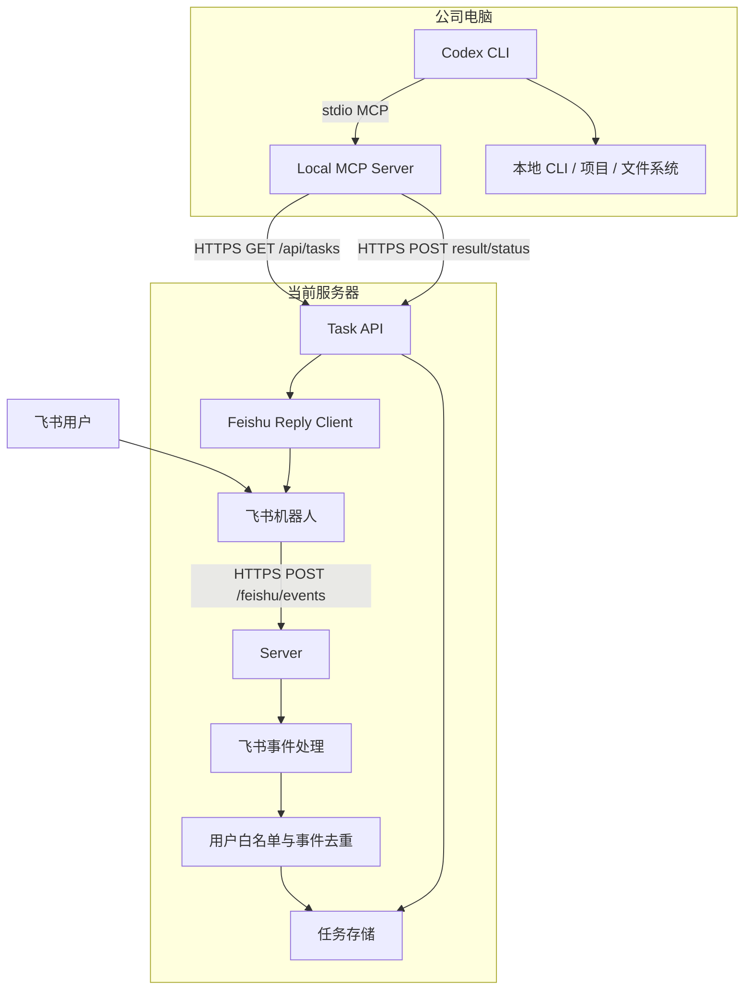

# harness-remote Development Guide

## 1. 中文开发文档

### 1.1 项目目标

`harness-remote` 的目标是建立一个低侵入的远程协作闭环：

```text
飞书
  -> 当前服务器
  -> 公司电脑本地 Codex CLI
  -> 本地处理
  -> 当前服务器
  -> 飞书
```

第一版不做自动远程控制，不安装公司电脑后台 agent，不实现服务器主动连接公司电脑。公司电脑侧只安装 Codex CLI 可使用的本地 MCP server，并且必须由用户主动打开 Codex CLI 后才会发生交互。

### 1.2 术语

- **当前服务器**：用户自己控制的服务器，接收飞书回调并保存任务。
- **公司电脑**：运行 Codex CLI 的本地电脑，不暴露端口，不接受服务器主动连接。
- **Local MCP Server**：由 Codex CLI 按 MCP 配置启动的本地进程，用来访问当前服务器的任务 API。
- **任务**：飞书消息在服务器中的持久化表示，等待用户在本地处理。
- **结果**：用户本地处理完成后，通过 MCP 上报给服务器并回复飞书的摘要。

### 1.3 非目标

- 不实现远程 shell。
- 不实现交互式 TTY。
- 不实现服务器主动唤醒或控制 Codex CLI。
- 不在公司电脑上运行后台常驻 remote-agent。
- 不让飞书消息直接自动执行公司电脑命令。
- 不做多租户、团队权限、审计平台或复杂工作流引擎。

### 1.4 核心用户流程

1. 用户在飞书中给机器人发送需求、命令意图或任务描述。
2. 飞书开放平台将消息事件推送到当前服务器。
3. 服务器校验事件来源、用户白名单和重复事件。
4. 合法消息被保存为 `pending` 任务。
5. 用户在公司电脑上打开 Codex CLI。
6. Codex CLI 调用本地 MCP server 的 `list_tasks` 和 `get_task` 工具。
7. 用户在本地确认并处理任务。
8. Codex CLI 调用 `report_task_result` 或 `reply_feishu`。
9. 服务器调用飞书 API，把结果回复到对应会话。

### 1.5 架构图



### 1.6 运行时组件

#### Server

服务端运行在当前服务器上，负责：

- 接收飞书事件回调。
- 完成 URL verification。
- 校验飞书事件 token 或解密事件体。
- 校验发送者是否在白名单中。
- 保存任务。
- 向本地 MCP server 暴露任务 API。
- 调用飞书回复 API。

#### Local MCP Server

本地 MCP server 运行在公司电脑上，但不是后台 agent。它由 Codex CLI 作为 MCP server 启动，生命周期跟随 Codex CLI 会话。

职责：

- 向 Codex CLI 暴露任务工具。
- 使用 HTTPS 主动访问当前服务器。
- 拉取任务、更新状态、上报结果。

#### Codex CLI

Codex CLI 是用户主动启动的本地交互入口。

职责：

- 调用 MCP 工具读取任务。
- 在本地项目和 CLI 环境中辅助用户处理任务。
- 由用户确认后上报结果。

### 1.7 安全边界

- 公司电脑不暴露端口。
- 当前服务器不主动连接公司电脑。
- 飞书消息不会直接触发公司电脑自动执行命令。
- MCP server 只在本地 Codex CLI 会话中运行。
- 服务端 API 使用 `Authorization: Bearer <personalToken>`。
- 飞书用户 ID 必须在白名单中才允许创建任务。
- 飞书事件必须做去重，避免事件重试导致重复任务。
- token、飞书密钥、真实用户 ID 和本地数据库文件不提交到 Git。

### 1.8 推荐技术栈

- Node.js 20+
- TypeScript
- npm
- HTTP framework：Fastify 或 Express，推荐 Fastify
- MCP SDK：官方 TypeScript MCP SDK
- 测试：Vitest
- 存储：SQLite，或第一版用 JSON 文件

推荐第一版使用 SQLite。原因是服务端重启后不能丢任务，而且比引入完整数据库服务更轻。

### 1.9 目录结构

```text
harness-remote/
  README.md
  package.json
  tsconfig.json
  .gitignore
  docs/
    DEVELOPMENT.md
  config/
    server.example.json
    mcp.example.json
  src/
    server/
      index.ts
      config.ts
      feishu/
        events.ts
        client.ts
      tasks/
        store.ts
        routes.ts
    mcp-server/
      index.ts
      config.ts
      tools.ts
    shared/
      types.ts
      errors.ts
      http.ts
  test/
    server/
    mcp-server/
    shared/
```

文件职责：

| 路径 | 职责 |
| --- | --- |
| `src/server/index.ts` | 服务端启动入口，负责加载配置、初始化存储、注册路由并启动 HTTP 服务 |
| `src/server/config.ts` | 读取和校验 `config/server.json` |
| `src/server/feishu/events.ts` | 解析飞书事件、处理 URL verification、提取消息上下文 |
| `src/server/feishu/client.ts` | 调用飞书开放平台 API，例如回复消息 |
| `src/server/tasks/store.ts` | 任务存储接口和 SQLite 实现入口 |
| `src/server/tasks/routes.ts` | `/api/tasks` 相关 HTTP 路由 |
| `src/mcp-server/index.ts` | 本地 stdio MCP server 启动入口 |
| `src/mcp-server/config.ts` | 读取和校验 `config/mcp.json` |
| `src/mcp-server/client.ts` | 本地 MCP server 调用当前服务器任务 API 的 HTTP client |
| `src/mcp-server/tools.ts` | 注册 `list_tasks`、`get_task` 等 MCP 工具 |
| `src/shared/types.ts` | 服务端和 MCP server 共享的任务类型 |
| `src/shared/errors.ts` | 统一错误类型和错误码 |
| `src/shared/http.ts` | 共享 HTTP 常量和鉴权 helper |
| `test/server/*` | 服务端单元与集成测试 |
| `test/mcp-server/*` | MCP 工具测试 |
| `test/shared/*` | 共享工具测试 |

占位代码规则：

- 骨架阶段允许文件只包含接口、类型和 `TODO`。
- 不允许在占位阶段伪造可运行能力。
- 未实现函数必须明确抛出 `TODO: implement ...`，避免误用。
- 文档中的文件名必须和实际框架保持一致。

### 1.10 配置文件

#### `config/server.example.json`

```json
{
  "port": 3000,
  "publicBaseUrl": "https://example.com",
  "personalToken": "replace-with-random-token",
  "storagePath": "./data/tasks.sqlite",
  "feishu": {
    "appId": "cli_xxx",
    "appSecret": "xxx",
    "verificationToken": "xxx",
    "encryptKey": "xxx",
    "allowedUserIds": ["ou_xxx"]
  }
}
```

#### `config/mcp.example.json`

```json
{
  "serverBaseUrl": "https://example.com",
  "personalToken": "replace-with-random-token",
  "defaultUser": "me"
}
```

#### Git 忽略规则

```gitignore
node_modules/
dist/
coverage/
data/
config/server.json
config/mcp.json
*.log
```

### 1.11 服务端 API

#### `GET /health`

返回服务健康状态。

响应：

```json
{
  "ok": true
}
```

#### `POST /feishu/events`

接收飞书事件订阅回调。

行为：

- URL verification 请求必须立即返回 challenge。
- 普通消息事件必须尽快返回 HTTP 200。
- 事件处理不能同步等待下游任务。
- 重复事件必须忽略。
- 非白名单用户消息必须忽略。

错误处理：

- URL verification 失败返回 `400`。
- 非法事件签名或解密失败返回 `401`。
- 已处理过的重复事件返回 `200`，但不创建任务。
- 非白名单用户返回 `200`，但不创建任务，避免飞书重复推送。

#### `GET /api/tasks`

本地 MCP server 拉取任务列表。

请求头：

```http
Authorization: Bearer <personalToken>
```

查询参数：

- `status`：可选，默认 `pending`。
- `limit`：可选，默认 `20`。

响应：

```json
{
  "tasks": [
    {
      "id": "task_123",
      "status": "pending",
      "commandText": "检查项目状态",
      "createdAt": "2026-06-01T12:00:00.000Z",
      "updatedAt": "2026-06-01T12:00:00.000Z"
    }
  ]
}
```

#### `GET /api/tasks/:id`

获取任务详情。

响应：

```json
{
  "task": {
    "id": "task_123",
    "source": "feishu",
    "feishuMessageId": "om_xxx",
    "feishuChatId": "oc_xxx",
    "feishuUserId": "ou_xxx",
    "commandText": "检查项目状态",
    "status": "pending",
    "createdAt": "2026-06-01T12:00:00.000Z",
    "updatedAt": "2026-06-01T12:00:00.000Z"
  }
}
```

#### `POST /api/tasks/:id/status`

更新任务状态。

请求：

```json
{
  "status": "running"
}
```

允许状态：

- `pending`
- `picked`
- `running`
- `done`
- `failed`

#### `POST /api/tasks/:id/result`

上报任务结果，并触发飞书回复。

请求：

```json
{
  "success": true,
  "summary": "已完成检查，当前工作区干净。",
  "details": "可选的更长说明"
}
```

服务端行为：

- 更新任务状态为 `done` 或 `failed`。
- 保存 `resultSummary` 和 `resultDetails`。
- 调用飞书消息回复 API。

### 1.12 API 错误模型

所有 `/api/*` 错误响应使用统一格式：

```json
{
  "error": {
    "code": "unauthorized",
    "message": "Missing or invalid bearer token"
  }
}
```

建议错误码：

- `unauthorized`：缺失或错误的 `personalToken`。
- `not_found`：任务不存在。
- `invalid_status`：状态不允许或状态值非法。
- `invalid_request`：请求体或参数格式错误。
- `feishu_reply_failed`：任务已保存，但飞书回复失败。
- `internal_error`：未预期错误。

### 1.13 MCP 工具设计

#### `list_tasks`

用途：列出服务器上的待处理任务。

输入：

```json
{
  "status": "pending",
  "limit": 20
}
```

输出：

```json
{
  "tasks": [
    {
      "id": "task_123",
      "status": "pending",
      "commandText": "检查项目状态",
      "createdAt": "2026-06-01T12:00:00.000Z"
    }
  ]
}
```

#### `get_task`

用途：获取单个任务详情。

输入：

```json
{
  "taskId": "task_123"
}
```

#### `mark_task_running`

用途：标记任务开始处理。

输入：

```json
{
  "taskId": "task_123"
}
```

#### `report_task_result`

用途：上报处理结果，并让服务器回复飞书。

输入：

```json
{
  "taskId": "task_123",
  "success": true,
  "summary": "处理完成。",
  "details": "可选详情"
}
```

#### `reply_feishu`

用途：向原飞书会话发送补充回复。

输入：

```json
{
  "taskId": "task_123",
  "message": "我已经看到任务，稍后处理。"
}
```

### 1.14 任务模型

```ts
export type TaskStatus = "pending" | "picked" | "running" | "done" | "failed";

export interface Task {
  id: string;
  source: "feishu";
  feishuMessageId: string;
  feishuChatId: string;
  feishuUserId: string;
  commandText: string;
  status: TaskStatus;
  createdAt: string;
  updatedAt: string;
  resultSummary?: string;
  resultDetails?: string;
}
```

### 1.15 任务状态流转

```text
pending
  -> picked
  -> running
  -> done

pending
  -> picked
  -> running
  -> failed
```

状态规则：

- `pending`：飞书消息已创建任务，尚未被本地 Codex CLI 读取。
- `picked`：本地 MCP server 已明确领取任务，但尚未开始处理。
- `running`：用户正在本地处理任务。
- `done`：任务成功完成，结果已保存。
- `failed`：任务处理失败，失败说明已保存。
- 第一版允许从 `pending` 直接到 `running`，降低 Codex CLI 调用工具的步骤成本。
- `done` 和 `failed` 是终态，默认不允许再次修改，除非后续实现重新打开任务。

### 1.16 存储设计

第一版推荐 SQLite。最低表结构：

```sql
CREATE TABLE tasks (
  id TEXT PRIMARY KEY,
  source TEXT NOT NULL,
  feishu_message_id TEXT NOT NULL,
  feishu_chat_id TEXT NOT NULL,
  feishu_user_id TEXT NOT NULL,
  command_text TEXT NOT NULL,
  status TEXT NOT NULL,
  result_summary TEXT,
  result_details TEXT,
  created_at TEXT NOT NULL,
  updated_at TEXT NOT NULL
);

CREATE UNIQUE INDEX idx_tasks_feishu_message_id
  ON tasks(feishu_message_id);

CREATE TABLE processed_events (
  event_id TEXT PRIMARY KEY,
  processed_at TEXT NOT NULL
);
```

边界：

- `feishu_message_id` 必须唯一，防止重复事件创建重复任务。
- `processed_events` 用于事件级去重，可定期清理旧数据。
- SQLite 文件默认放在 `data/tasks.sqlite`，该目录必须加入 `.gitignore`。

### 1.17 飞书集成

服务端需要实现：

- URL verification。
- 事件 token 校验。
- 可选 encrypt key 解密。
- 消息事件解析。
- sender user id 提取。
- chat id 和 message id 提取。
- 文本内容提取。
- 回复消息 API client。

飞书事件处理边界：

- 回调处理必须快速返回。
- 相同 `event_id` 或 message id 在短时间内只处理一次。
- 群聊消息必须明确提到机器人后才创建任务。
- 私聊消息只要来自白名单用户即可创建任务。

飞书开放平台配置清单：

- 创建自建应用并启用机器人能力。
- 配置事件订阅回调地址：`https://<domain>/feishu/events`。
- 订阅接收消息相关事件。
- 申请读取消息发送者、接收消息事件、回复消息所需权限。
- 配置 verification token 和 encrypt key。
- 发布应用配置，让权限和事件订阅生效。
- 在服务端配置中写入允许触发任务的飞书用户 ID。

### 1.18 本地 Codex CLI MCP 配置

Codex CLI 需要配置本地 MCP server。示例：

```toml
[mcp_servers.harness_remote]
command = "node"
args = ["/path/to/harness-remote/dist/mcp-server/index.js", "--config", "/path/to/harness-remote/config/mcp.json"]
```

Windows 示例：

```toml
[mcp_servers.harness_remote]
command = "node"
args = ["C:\\path\\to\\harness-remote\\dist\\mcp-server\\index.js", "--config", "C:\\path\\to\\harness-remote\\config\\mcp.json"]
```

### 1.19 部署要求

当前服务器需要：

- Node.js 20+
- npm
- Git
- 公网 HTTPS 域名
- 反向代理，例如 Caddy 或 Nginx
- 进程管理，例如 pm2 或 systemd

公司电脑需要：

- Codex CLI
- Node.js 20+
- Git
- 本项目代码
- 本地 `config/mcp.json`

公司电脑不需要：

- 公网 IP
- 开放端口
- 内网穿透
- 后台 remote-agent
- WebSocket 常驻连接

### 1.20 服务器部署检查清单

- 域名已解析到当前服务器。
- HTTPS 证书有效。
- 反向代理把 `/feishu/events` 和 `/api/*` 转发到 Node 服务。
- 反向代理请求体大小足够处理飞书事件。
- Node 服务以非 root 用户运行。
- `config/server.json` 权限限制为仅部署用户可读。
- `data/` 目录可写且不在 Git 跟踪中。
- 进程管理已配置重启策略。
- 日志中不打印 token、飞书密钥或完整消息正文。

### 1.21 本地使用检查清单

- 公司电脑已安装 Node.js 20+。
- 公司电脑已安装 Codex CLI。
- 本项目已拉取到本地。
- `config/mcp.json` 已配置服务器地址和 `personalToken`。
- Codex CLI 的 MCP 配置指向构建后的本地 MCP server。
- 打开 Codex CLI 后，可以调用 `list_tasks`。

### 1.22 开发顺序

1. 初始化 TypeScript 项目骨架。
2. 添加配置示例、`.gitignore` 和基础脚本。
3. 添加共享类型、错误类型和 HTTP helper 占位。
4. 添加服务端入口、飞书模块、任务模块占位。
5. 添加本地 MCP server 入口、HTTP client 和工具注册占位。
6. 添加测试文件占位。
7. 实现配置加载。
8. 实现任务存储。
9. 实现服务端健康检查和 API token 校验。
10. 实现任务 API。
11. 实现飞书事件接收和任务创建。
12. 实现飞书回复 API client。
13. 实现本地 MCP server 和工具注册。
14. 补齐测试。
15. 完善 README、部署文档和示例配置。

### 1.23 开发里程碑

#### Milestone 1：项目骨架

完成定义：

- `package.json`、`tsconfig.json`、基础目录结构已创建。
- 所有计划中的源码文件和测试文件已创建。
- 未实现函数明确抛出 `TODO: implement ...`。
- `npm run build` 在依赖安装后可执行。
- `README.md` 和 `docs/DEVELOPMENT.md` 与实际脚本名称一致。

#### Milestone 2：任务 API

完成定义：

- 服务端可启动并提供 `GET /health`。
- `/api/tasks`、`/api/tasks/:id`、`/api/tasks/:id/status`、`/api/tasks/:id/result` 已实现。
- `/api/*` 全部校验 `Authorization: Bearer <personalToken>`。
- SQLite 存储可保存任务、状态和结果。

#### Milestone 3：飞书入口

完成定义：

- `POST /feishu/events` 可通过飞书 URL verification。
- 白名单用户消息可创建任务。
- 非白名单用户消息不创建任务。
- 重复事件不会重复创建任务。
- 飞书回调处理不等待本地处理结果。

#### Milestone 4：本地 MCP

完成定义：

- Codex CLI 可启动本地 MCP server。
- `list_tasks`、`get_task`、`mark_task_running`、`report_task_result`、`reply_feishu` 可调用。
- MCP 工具通过 HTTPS 调用服务端 API。
- 本地 MCP server 不监听网络端口。

#### Milestone 5：端到端闭环

完成定义：

- 飞书消息生成 `pending` 任务。
- 公司电脑 Codex CLI 通过 MCP 读取任务。
- 用户本地处理后通过 MCP 上报结果。
- 飞书收到结果回复。
- 公司电脑没有后台常驻远控进程。

### 1.24 测试计划

#### 单元测试

- 配置文件缺失时报错。
- API token 校验。
- 任务创建、查询、状态更新、结果保存。
- 飞书白名单校验。
- 飞书重复事件去重。
- 私聊和群聊消息解析。
- MCP 工具参数校验。

#### 集成测试

- 模拟飞书事件，确认创建任务。
- MCP `list_tasks` 能读取任务。
- MCP `report_task_result` 能更新任务并触发飞书回复 client。
- 非白名单用户消息不创建任务。
- 重复事件只创建一次任务。

#### 手动验收

- 飞书发送消息后服务器生成 `pending` 任务。
- 公司电脑打开 Codex CLI 后能通过 MCP 查看任务。
- 本地处理后通过 MCP 上报结果。
- 飞书收到结果回复。
- 公司电脑没有常驻后台进程。

### 1.25 日志与隐私

日志应记录：

- 请求路径、状态码、耗时。
- 任务 ID、状态变化。
- 飞书事件是否通过校验。
- MCP 工具调用结果。

日志不应记录：

- `personalToken`。
- 飞书 `appSecret`、`verificationToken`、`encryptKey`。
- 未脱敏的 Authorization header。
- 大段飞书消息正文。
- 用户本地处理结果的完整详情，除非显式开启调试模式。

### 1.26 故障排查

#### 飞书 URL verification 失败

- 检查公网 HTTPS 是否能访问。
- 检查反向代理是否转发到 Node 服务。
- 检查 verification token 和 encrypt key 配置。
- 检查服务端是否按飞书 challenge 格式返回。

#### 飞书消息没有生成任务

- 检查发送者是否在 `allowedUserIds` 中。
- 检查消息类型是否为文本。
- 检查群聊中是否明确提到机器人。
- 检查事件是否被去重逻辑识别为已处理。

#### Codex CLI 看不到 MCP 工具

- 检查 Codex CLI MCP 配置路径。
- 检查 `npm run build` 是否生成 `dist/mcp-server/index.js`。
- 检查 `config/mcp.json` 路径是否正确。
- 检查 Node.js 版本是否为 20+。

#### MCP 工具无法连接服务器

- 检查 `serverBaseUrl` 是否为 HTTPS 地址。
- 检查 `personalToken` 是否与服务端一致。
- 检查服务器 `/health` 是否可访问。
- 检查公司网络是否允许访问当前服务器域名。

### 1.27 版本范围

#### v1

- 单服务器。
- 单用户或少量白名单用户。
- 本地 Codex CLI 主动拉取任务。
- SQLite 或 JSON 文件存储。
- 飞书机器人消息入口。

#### v2 可选方向

- 多设备任务分配。
- Web 管理页面。
- 任务历史搜索。
- 更细的权限控制。
- 审计日志。
- 公司允许时再考虑受控自动执行。

### 1.28 实现决策记录

- 选择 MCP 拉取模型，而不是后台 agent 推送模型，是为了避免公司电脑被外部系统主动控制。
- 选择飞书消息先保存为任务，而不是直接变成命令，是为了保留本地人工确认。
- 选择 `personalToken` 而不是完整 OAuth，是因为第一版只服务个人工作流。
- 选择 SQLite 是为了在不引入数据库服务的情况下保留任务历史和去重记录。

### 1.29 十轮设计迭代记录

| 版本 | 优化主题 | 结果 |
| --- | --- | --- |
| v1 | 文档一致性 | 修正目录结构和实际文件框架的对应关系 |
| v2 | 模块边界 | 明确 server、mcp-server、shared 的依赖方向 |
| v3 | 数据生命周期 | 补充任务从飞书消息到结果回复的完整生命周期 |
| v4 | 配置契约 | 明确配置字段校验、默认值和缺失时行为 |
| v5 | 安全威胁模型 | 记录可接受风险和必须防护的风险 |
| v6 | API 契约 | 补充状态码、幂等性和错误响应要求 |
| v7 | MCP 契约 | 明确工具调用输入、输出和失败语义 |
| v8 | 运维手册 | 增加启动、升级、备份、恢复和日志检查流程 |
| v9 | 测试矩阵 | 把测试计划拆成模块、场景、优先级 |
| v10 | 质量门禁 | 定义进入实现、合并和发布前的检查项 |

### 1.30 模块依赖规则

依赖方向必须保持单向：

```text
src/server/*      -> src/shared/*
src/mcp-server/*  -> src/shared/*
test/*            -> src/*
```

禁止依赖：

- `src/shared/*` 不得依赖 `src/server/*` 或 `src/mcp-server/*`。
- `src/server/*` 不得依赖 `src/mcp-server/*`。
- `src/mcp-server/*` 不得依赖 `src/server/*` 的内部模块，只能通过 HTTP API 访问服务端。
- 测试可以导入实现模块，但实现模块不得导入测试工具。

设计理由：

- 服务端和本地 MCP server 是两个独立运行时。
- `shared` 只能放稳定类型、错误码和纯 helper。
- 本地 MCP server 必须通过公开 API 与服务端通信，避免形成隐藏的本地耦合。

### 1.31 数据生命周期

```text
Feishu message
  -> Feishu event callback
  -> event validation
  -> deduplication
  -> allowlist check
  -> task creation
  -> local MCP list/get
  -> local handling
  -> result report
  -> Feishu reply
  -> terminal task state
```

关键约束：

- 飞书事件进入服务端后，应先完成校验再创建任务。
- 去重应早于任务创建，避免重复消息产生重复任务。
- 白名单校验失败时不创建任务，但仍返回 200，避免飞书重试。
- 本地 MCP 拉取任务不会改变任务内容。
- `report_task_result` 是任务进入终态的主要入口。
- 飞书回复失败时，任务结果仍应保存，并记录 `feishu_reply_failed` 错误。

### 1.32 配置契约

服务端配置校验：

| 字段 | 必填 | 规则 |
| --- | --- | --- |
| `port` | 是 | 1 到 65535 的整数 |
| `publicBaseUrl` | 是 | 必须是 HTTPS URL，开发环境可显式允许 HTTP |
| `personalToken` | 是 | 长度至少 24 字符 |
| `storagePath` | 是 | 指向 SQLite 文件路径 |
| `feishu.appId` | 是 | 非空字符串 |
| `feishu.appSecret` | 是 | 非空字符串 |
| `feishu.verificationToken` | 是 | 非空字符串 |
| `feishu.encryptKey` | 否 | 为空时不启用事件体解密 |
| `feishu.allowedUserIds` | 是 | 至少包含一个用户 ID |

MCP 配置校验：

| 字段 | 必填 | 规则 |
| --- | --- | --- |
| `serverBaseUrl` | 是 | 必须是 HTTPS URL |
| `personalToken` | 是 | 必须与服务端一致 |
| `defaultUser` | 否 | 用于日志和本地显示，不参与鉴权 |

配置加载失败时：

- 程序必须启动失败。
- 错误消息应指出缺失或非法字段名。
- 不得在错误中打印 token 或 secret 的完整值。

### 1.33 安全威胁模型

| 风险 | 防护策略 | v1 是否必须 |
| --- | --- | --- |
| 非授权飞书用户创建任务 | 飞书用户 ID 白名单 | 是 |
| 伪造服务端 API 请求 | `personalToken` Bearer 鉴权 | 是 |
| 飞书事件重复投递 | event/message 去重 | 是 |
| 配置密钥泄露到 Git | `.gitignore` 和 example 配置分离 | 是 |
| 公司电脑被远程控制 | 不提供 server -> company computer 通道 | 是 |
| 长消息泄露到日志 | 日志脱敏和正文截断 | 是 |
| 服务端数据库丢失 | SQLite 文件备份 | 建议 |
| 多人共用权限混乱 | 多用户权限模型 | v1 不做 |

可接受风险：

- 白名单用户可以创建任意任务文本。
- 本地 Codex CLI 会话内的处理行为由本地用户确认和承担。
- v1 使用单个 `personalToken`，不区分设备级 token。

不可接受风险：

- 未授权用户创建任务。
- 飞书消息直接触发公司电脑命令执行。
- 当前服务器主动连接公司电脑。
- token、飞书密钥或完整 Authorization header 被写入日志。

### 1.34 API 契约补充

HTTP 状态码约定：

| 场景 | 状态码 |
| --- | --- |
| 请求成功 | `200` |
| 创建任务成功 | `201` |
| 请求体非法 | `400` |
| token 缺失或错误 | `401` |
| 资源不存在 | `404` |
| 状态流转非法 | `409` |
| 未预期错误 | `500` |

幂等性要求：

- 同一个飞书 `message_id` 只能创建一条任务。
- 重复上报同一个终态结果时，默认返回当前任务，不重复回复飞书。
- `mark_task_running` 对已是 `running` 的任务应保持幂等。
- 对 `done` 或 `failed` 任务再次改状态应返回 `409`。

分页与排序：

- `GET /api/tasks` 默认按 `createdAt DESC` 排序。
- `limit` 默认 `20`，最大 `100`。
- v1 可以不实现 cursor，但接口设计不得阻止后续添加 `cursor`。

### 1.35 MCP 契约补充

MCP 工具原则：

- 工具名使用 snake_case。
- 工具输入必须有 schema。
- 工具输出必须是结构化 JSON，不只返回人类可读文本。
- 失败时返回明确错误信息，避免 Codex CLI 误判为没有任务。

工具失败语义：

| 工具 | 失败场景 | 期望行为 |
| --- | --- | --- |
| `list_tasks` | 服务端不可达 | 返回连接错误和 serverBaseUrl |
| `get_task` | 任务不存在 | 返回 `not_found` |
| `mark_task_running` | 任务已终态 | 返回 `invalid_status` |
| `report_task_result` | 飞书回复失败 | 返回任务已保存但回复失败 |
| `reply_feishu` | message id 无效 | 返回飞书 API 错误摘要 |

本地 MCP server 不应：

- 监听 HTTP 端口。
- 保存长期任务状态。
- 直接解析飞书事件。
- 直接访问 SQLite 数据库。

### 1.36 运维手册

服务端启动：

```bash
npm run build
npm run server -- --config config/server.json
```

服务端升级：

1. 拉取新代码。
2. 备份 `data/tasks.sqlite`。
3. 安装依赖。
4. 执行构建和测试。
5. 重启 Node 服务。
6. 检查 `/health`。

备份：

- 每日备份 `data/tasks.sqlite`。
- 备份文件不得提交到 Git。
- 备份文件应和配置密钥分开保存。

恢复：

1. 停止服务端进程。
2. 替换 SQLite 文件。
3. 启动服务端。
4. 检查最近任务和 `/health`。

日志检查：

- 检查飞书回调是否有 4xx/5xx。
- 检查 MCP API 是否有 401。
- 检查是否出现 `feishu_reply_failed`。
- 检查是否有重复事件被正确忽略。

### 1.37 测试矩阵

| 模块 | 场景 | 优先级 |
| --- | --- | --- |
| 配置加载 | 缺失配置文件 | P0 |
| 配置加载 | token 过短 | P0 |
| 任务存储 | 创建和查询任务 | P0 |
| 任务存储 | 重复 `feishu_message_id` | P0 |
| 任务 API | 未授权请求 | P0 |
| 任务 API | 非法状态流转 | P0 |
| 飞书事件 | URL verification | P0 |
| 飞书事件 | 非白名单用户 | P0 |
| 飞书事件 | 重复事件 | P0 |
| MCP 工具 | list/get/report 成功路径 | P0 |
| MCP 工具 | 服务端不可达 | P1 |
| 飞书回复 | API 失败但结果已保存 | P1 |
| 日志 | token 不出现在日志中 | P1 |

P0 必须在 MVP 合并前通过。P1 必须在对外部署前通过。

### 1.38 质量门禁

进入实现前：

- 文件骨架和文档目录一致。
- 配置字段和 API 字段已在文档中定义。
- 明确哪些能力不做。

合并前：

- `npm run typecheck` 通过。
- `npm test` 通过。
- 新增接口有测试覆盖。
- README 中的命令与 `package.json` 一致。
- 未实现能力不能在 README 中描述成已完成。

发布前：

- 示例配置不包含真实密钥。
- `.gitignore` 覆盖本地配置和数据库。
- 飞书回调路径通过真实 URL verification。
- 本地 Codex CLI 能看到 MCP 工具。
- 文档中的安全边界仍然成立。

### 1.39 第二组十轮设计迭代记录

| 版本 | 优化主题 | 结果 |
| --- | --- | --- |
| v11 | DTO 定义 | 补充 HTTP API 请求和响应对象 |
| v12 | 数据库迁移 | 定义迁移文件命名、执行和回滚策略 |
| v13 | 飞书事件样例 | 补充 URL verification 和消息事件解析样例 |
| v14 | MCP schema | 明确每个工具的输入输出 schema |
| v15 | CLI 参数 | 定义 server 和 mcp-server 的命令行参数 |
| v16 | 部署拓扑 | 明确单机部署、反向代理和本地 MCP 的连接方式 |
| v17 | 兼容性 | 记录 Node、系统、Codex CLI、飞书平台的兼容范围 |
| v18 | 发布版本 | 定义版本号、发布包和变更记录策略 |
| v19 | 验收脚本 | 补充人工和半自动验收命令 |
| v20 | 文档维护 | 定义文档更新规则，防止 README 与实现漂移 |

### 1.40 HTTP DTO 定义

任务列表响应：

```ts
export interface ListTasksResponse {
  tasks: TaskSummary[];
}

export interface TaskSummary {
  id: string;
  status: TaskStatus;
  commandText: string;
  createdAt: string;
  updatedAt: string;
}
```

任务详情响应：

```ts
export interface GetTaskResponse {
  task: Task;
}
```

状态更新请求：

```ts
export interface UpdateTaskStatusRequest {
  status: "picked" | "running" | "done" | "failed";
}
```

结果上报请求：

```ts
export interface ReportTaskResultRequest {
  success: boolean;
  summary: string;
  details?: string;
}
```

补充回复请求：

```ts
export interface ReplyFeishuRequest {
  message: string;
}
```

DTO 规则：

- HTTP DTO 应放在 `src/shared/types.ts` 或后续拆出的 `src/shared/dto.ts`。
- 请求 DTO 只表达外部输入，不包含服务端内部字段。
- 响应 DTO 不返回飞书密钥、token 或内部错误栈。
- `summary` 建议限制在 4000 字符以内。
- `details` 可以更长，但 v1 回复飞书时应只发送摘要。

### 1.41 数据库迁移策略

迁移目录规划：

```text
src/server/tasks/migrations/
  0001_create_tasks.sql
  0002_add_reply_status.sql
```

迁移规则：

- 迁移文件名使用递增数字前缀。
- 服务端启动时自动执行未应用迁移。
- 应建立 `schema_migrations` 表记录已应用版本。
- 每个迁移必须可重复检测，不能依赖手工修改数据库。
- v1 可以不实现自动回滚，但必须支持从备份恢复。

`schema_migrations`：

```sql
CREATE TABLE schema_migrations (
  version TEXT PRIMARY KEY,
  applied_at TEXT NOT NULL
);
```

迁移失败行为：

- 服务端启动失败。
- 日志记录迁移版本和错误摘要。
- 不继续启动 HTTP 服务。
- 不自动删除或重建已有数据库。

### 1.42 飞书事件样例

URL verification 概念请求：

```json
{
  "type": "url_verification",
  "challenge": "challenge-token",
  "token": "verification-token"
}
```

响应：

```json
{
  "challenge": "challenge-token"
}
```

文本消息事件归一化后应得到：

```ts
export interface FeishuEventContext {
  eventId: string;
  messageId: string;
  chatId: string;
  userId: string;
  text: string;
  chatType: "p2p" | "group";
  mentionedBot: boolean;
}
```

解析规则：

- 只处理文本消息。
- 文本前后空白应 trim。
- 私聊消息来自白名单用户即可创建任务。
- 群聊消息必须提到机器人。
- 无法识别 `messageId`、`chatId` 或 `userId` 的事件不创建任务。

### 1.43 MCP 工具 Schema

`list_tasks`：

```json
{
  "type": "object",
  "properties": {
    "status": {
      "type": "string",
      "enum": ["pending", "picked", "running", "done", "failed"]
    },
    "limit": {
      "type": "number",
      "minimum": 1,
      "maximum": 100
    }
  }
}
```

`get_task`：

```json
{
  "type": "object",
  "required": ["taskId"],
  "properties": {
    "taskId": {
      "type": "string",
      "minLength": 1
    }
  }
}
```

`report_task_result`：

```json
{
  "type": "object",
  "required": ["taskId", "success", "summary"],
  "properties": {
    "taskId": { "type": "string", "minLength": 1 },
    "success": { "type": "boolean" },
    "summary": { "type": "string", "minLength": 1, "maxLength": 4000 },
    "details": { "type": "string" }
  }
}
```

Schema 规则：

- 所有工具必须拒绝未知必填字段缺失。
- 可选字段缺失时使用服务端默认值。
- MCP 工具输出应包含 `ok: boolean`。
- 失败输出应包含 `error.code` 和 `error.message`。

### 1.44 CLI 参数设计

服务端入口：

```bash
npm run server -- --config config/server.json
```

本地 MCP 入口：

```bash
npm run mcp -- --config config/mcp.json
```

参数规则：

- `--config` 可选，未提供时使用默认路径。
- 默认服务端配置路径：`config/server.json`。
- 默认 MCP 配置路径：`config/mcp.json`。
- `--help` 输出命令说明。
- `--version` 输出 `package.json` 版本。
- CLI 参数优先级高于默认值，但低于后续明确设计的环境变量覆盖。

### 1.45 部署拓扑

推荐拓扑：

```text
Feishu Open Platform
  -> HTTPS
  -> Caddy/Nginx on current server
  -> Node server on 127.0.0.1:3000
  -> SQLite data/tasks.sqlite

Company computer
  -> Codex CLI
  -> local stdio MCP server
  -> HTTPS
  -> current server /api/*
```

反向代理要求：

- 对外只暴露 HTTPS。
- Node 服务只监听本机地址或受控内网地址。
- `/feishu/events` 和 `/api/*` 都转发到 Node 服务。
- 保留原始请求体，便于飞书事件校验。
- 访问日志不得记录 Authorization header。

### 1.46 兼容性矩阵

| 项目 | v1 支持 |
| --- | --- |
| Node.js | 20+ |
| 包管理器 | npm |
| 服务端 OS | Linux 优先 |
| 公司电脑 OS | Windows、macOS、Linux |
| Codex CLI | 支持 MCP stdio 配置的版本 |
| 飞书 | 自建应用机器人 |
| 数据库 | SQLite |
| 浏览器 | 不涉及 |

兼容性原则：

- 服务端优先保证 Linux 部署体验。
- 本地 MCP server 不使用平台专属能力。
- 路径示例需要同时给出 POSIX 和 Windows 写法。
- 不引入需要管理员权限的本地能力。

### 1.47 发布与版本策略

版本号：

- `0.0.x`：文档和骨架阶段。
- `0.1.x`：MVP 可用，但 API 仍可能调整。
- `1.0.0`：API、MCP 工具和配置格式进入稳定期。

发布内容：

- 源码。
- 示例配置。
- README。
- 开发文档。
- 变更记录。

发布前必须更新：

- `package.json` 版本。
- README 状态说明。
- `docs/DEVELOPMENT.md` 中的兼容性和验收说明。
- `CHANGELOG.md`，如该文件已创建。

### 1.48 验收脚本规划

服务端健康检查：

```bash
curl -fsS http://127.0.0.1:3000/health
```

API 鉴权检查：

```bash
curl -i http://127.0.0.1:3000/api/tasks
```

预期：未带 token 返回 `401`。

任务 API 检查：

```bash
curl -H "Authorization: Bearer <token>" \
  "http://127.0.0.1:3000/api/tasks?status=pending"
```

MCP 本地检查：

```bash
npm run mcp -- --config config/mcp.json
```

验收原则：

- 验收脚本不得依赖真实公司电脑远控能力。
- 涉及飞书的验收需要提供 mock 模式或手工步骤。
- 所有脚本不得打印完整 token。

### 1.49 文档维护规则

README 维护规则：

- README 只放用户入口、边界、快速开始和常见问题。
- 未实现功能必须标为 Planned。
- 已移除功能必须从 README 中移除或标记为 Not planned。

开发文档维护规则：

- API 字段变化必须同步更新 DTO、测试矩阵和 MCP 工具说明。
- 配置字段变化必须同步更新 example config。
- 新增源码文件必须同步更新目录结构和文件职责表。
- 安全边界变化必须同步更新威胁模型和 FAQ。

文档审查清单：

- README 命令与 `package.json` 一致。
- 目录结构与 `find src test config docs` 输出一致。
- 中英文核心结论一致。
- 计划能力和已实现能力没有混写。

---

## 2. English Development Guide

### 2.1 Project Goal

`harness-remote` builds a low-intrusion remote collaboration loop:

```text
Feishu
  -> server
  -> local Codex CLI on the company computer
  -> local handling
  -> server
  -> Feishu
```

Version 1 does not provide automatic remote control, does not install a background agent on the company computer, and does not allow the server to connect to the company computer. The company computer only runs a local MCP server launched by Codex CLI, and interaction only happens when the user explicitly starts Codex CLI.

### 2.2 Terminology

- **Current server**: the user-controlled server that receives Feishu callbacks and stores tasks.
- **Company computer**: the local machine running Codex CLI. It exposes no ports and accepts no server-initiated connection.
- **Local MCP Server**: the local process launched by Codex CLI from its MCP configuration. It calls the current server's task APIs.
- **Task**: the persisted representation of a Feishu message waiting for local handling.
- **Result**: the summary reported back through MCP after local handling, then sent to Feishu by the server.

### 2.3 Non-Goals

- No remote shell.
- No interactive TTY.
- No server-initiated control of Codex CLI.
- No persistent remote-control agent on the company computer.
- No automatic local command execution triggered directly by Feishu.
- No multi-tenant permission system or complex workflow engine.

### 2.4 Core User Flow

1. The user sends a request, command intent, or task description to a Feishu bot.
2. Feishu pushes the message event to the server.
3. The server validates the event, sender allowlist, and duplicate event state.
4. A valid message is stored as a `pending` task.
5. The user opens Codex CLI on the company computer.
6. Codex CLI calls local MCP tools such as `list_tasks` and `get_task`.
7. The user reviews and handles the task locally.
8. Codex CLI calls `report_task_result` or `reply_feishu`.
9. The server replies to the original Feishu conversation.

### 2.5 Runtime Components

#### Server

The server runs on the personal/current server and is responsible for:

- Receiving Feishu event callbacks.
- Handling URL verification.
- Validating event tokens or decrypting event bodies.
- Checking the sender allowlist.
- Storing tasks.
- Exposing task APIs for the local MCP server.
- Calling Feishu reply APIs.

#### Local MCP Server

The local MCP server runs on the company computer, but it is not a background agent. It is started by Codex CLI as an MCP server and its lifecycle follows the Codex CLI session.

Responsibilities:

- Expose task tools to Codex CLI.
- Actively call the server over HTTPS.
- Fetch tasks, update task status, and report results.

#### Codex CLI

Codex CLI is the local interactive entrypoint manually started by the user.

Responsibilities:

- Use MCP tools to read tasks.
- Help process tasks in the local project and CLI environment.
- Report results after user confirmation.

### 2.6 Security Boundary

- The company computer exposes no ports.
- The server never connects to the company computer.
- Feishu messages do not directly execute commands on the company computer.
- The MCP server only runs inside a local Codex CLI session.
- Server APIs use `Authorization: Bearer <personalToken>`.
- Only allowlisted Feishu users can create tasks.
- Feishu events are deduplicated to avoid duplicate task creation.
- Tokens, Feishu secrets, real user IDs, and local database files are not committed to Git.

### 2.7 Recommended Stack

- Node.js 20+
- TypeScript
- npm
- HTTP framework: Fastify or Express, Fastify recommended
- MCP SDK: official TypeScript MCP SDK
- Test runner: Vitest
- Storage: SQLite, or JSON file storage for the smallest first version

SQLite is recommended for v1 so tasks survive server restarts without requiring a separate database service.

### 2.8 API Summary

- `GET /health`
  - Returns server health.
- `POST /feishu/events`
  - Receives Feishu event callbacks.
  - Handles URL verification.
  - Creates tasks from valid messages.
- `GET /api/tasks`
  - Lists tasks for the local MCP server.
- `GET /api/tasks/:id`
  - Returns one task.
- `POST /api/tasks/:id/status`
  - Updates task status.
- `POST /api/tasks/:id/result`
  - Stores the result and replies in Feishu.

All `/api/*` endpoints require:

```http
Authorization: Bearer <personalToken>
```

Error responses for `/api/*` use this shape:

```json
{
  "error": {
    "code": "unauthorized",
    "message": "Missing or invalid bearer token"
  }
}
```

Recommended error codes:

- `unauthorized`
- `not_found`
- `invalid_status`
- `invalid_request`
- `feishu_reply_failed`
- `internal_error`

### 2.9 MCP Tools

- `list_tasks`
  - Lists tasks from the server.
- `get_task`
  - Gets full task details.
- `mark_task_running`
  - Marks a task as running.
- `report_task_result`
  - Reports task result and triggers a Feishu reply.
- `reply_feishu`
  - Sends an extra Feishu reply for a task.

### 2.10 Task State Flow

```text
pending
  -> picked
  -> running
  -> done

pending
  -> picked
  -> running
  -> failed
```

Rules:

- `pending`: created from a Feishu message and not yet picked locally.
- `picked`: explicitly claimed by local Codex CLI through MCP.
- `running`: the user is handling it locally.
- `done`: completed successfully and result saved.
- `failed`: failed with a saved failure summary.
- v1 may allow `pending` to go directly to `running` to reduce MCP tool-call overhead.
- `done` and `failed` are terminal states unless a future version adds reopen support.

### 2.11 Storage Design

SQLite is the recommended v1 storage. Minimum schema:

```sql
CREATE TABLE tasks (
  id TEXT PRIMARY KEY,
  source TEXT NOT NULL,
  feishu_message_id TEXT NOT NULL,
  feishu_chat_id TEXT NOT NULL,
  feishu_user_id TEXT NOT NULL,
  command_text TEXT NOT NULL,
  status TEXT NOT NULL,
  result_summary TEXT,
  result_details TEXT,
  created_at TEXT NOT NULL,
  updated_at TEXT NOT NULL
);

CREATE UNIQUE INDEX idx_tasks_feishu_message_id
  ON tasks(feishu_message_id);

CREATE TABLE processed_events (
  event_id TEXT PRIMARY KEY,
  processed_at TEXT NOT NULL
);
```

Boundaries:

- `feishu_message_id` must be unique to avoid duplicate task creation.
- `processed_events` supports event-level deduplication and may be cleaned periodically.
- The SQLite file defaults to `data/tasks.sqlite`, and `data/` must be ignored by Git.

### 2.12 Feishu Integration Checklist

- Create a custom Feishu app and enable bot capability.
- Configure event callback URL: `https://<domain>/feishu/events`.
- Subscribe to message-receive events.
- Request permissions needed to receive messages, identify senders, and reply to messages.
- Configure verification token and encrypt key.
- Publish the app configuration so permissions and event subscriptions take effect.
- Add allowed Feishu user IDs to `config/server.json`.

### 2.13 Deployment Checklist

Server:

- Domain points to the current server.
- HTTPS certificate is valid.
- Reverse proxy forwards `/feishu/events` and `/api/*` to the Node service.
- Request body size is sufficient for Feishu event payloads.
- Node service runs as a non-root user.
- `config/server.json` is readable only by the deployment user.
- `data/` is writable and ignored by Git.
- Process manager restart policy is configured.
- Logs do not print tokens, Feishu secrets, or full message bodies.

Company computer:

- Node.js 20+ is installed.
- Codex CLI is installed.
- This repository is available locally.
- `config/mcp.json` contains `serverBaseUrl` and `personalToken`.
- Codex CLI MCP configuration points to the built local MCP server.
- `list_tasks` works from a Codex CLI session.

### 2.14 Logging and Privacy

Logs should include:

- Request path, status code, and duration.
- Task ID and status transitions.
- Whether Feishu event validation passed.
- MCP tool-call result status.

Logs should not include:

- `personalToken`.
- Feishu `appSecret`, `verificationToken`, or `encryptKey`.
- Raw Authorization headers.
- Large Feishu message bodies.
- Full local result details unless debug mode is explicitly enabled.

### 2.15 Implementation Order

1. Initialize the TypeScript project skeleton.
2. Add example configs, `.gitignore`, and base scripts.
3. Add shared types, error types, and HTTP helper placeholders.
4. Add server entrypoint, Feishu module, and task module placeholders.
5. Add local MCP server entrypoint, HTTP client, and tool registration placeholders.
6. Add placeholder test files.
7. Implement config loading.
8. Implement task storage.
9. Implement server health check and API token auth.
10. Implement task APIs.
11. Implement Feishu event handling and task creation.
12. Implement the Feishu reply API client.
13. Implement the local MCP server and tool registration.
14. Complete tests.
15. Complete README, deployment docs, and example configs.

### 2.16 Milestones

#### Milestone 1: Project Skeleton

Done when:

- `package.json`, `tsconfig.json`, and the base directory layout exist.
- All planned source and test files exist.
- Unimplemented functions explicitly throw `TODO: implement ...`.
- `npm run build` runs after dependencies are installed.
- README and development docs match the actual script names.

#### Milestone 2: Task API

Done when:

- The server starts and exposes `GET /health`.
- `/api/tasks`, `/api/tasks/:id`, `/api/tasks/:id/status`, and `/api/tasks/:id/result` are implemented.
- All `/api/*` endpoints validate `Authorization: Bearer <personalToken>`.
- SQLite stores tasks, statuses, and results.

#### Milestone 3: Feishu Entry

Done when:

- `POST /feishu/events` passes Feishu URL verification.
- Messages from allowlisted users create tasks.
- Messages from other users do not create tasks.
- Duplicate events do not create duplicate tasks.
- Feishu callback handling does not wait for local processing.

#### Milestone 4: Local MCP

Done when:

- Codex CLI can start the local MCP server.
- `list_tasks`, `get_task`, `mark_task_running`, `report_task_result`, and `reply_feishu` are callable.
- MCP tools call the server API over HTTPS.
- The local MCP server does not listen on a network port.

#### Milestone 5: End-to-End Loop

Done when:

- A Feishu message creates a `pending` task.
- Codex CLI on the company computer reads it through MCP.
- The user reports a result through MCP after local handling.
- Feishu receives the result reply.
- The company computer runs no persistent background remote-control process.

### 2.17 Acceptance Criteria

- A Feishu message from an allowlisted user creates a `pending` task.
- The local MCP server can list and fetch the task from Codex CLI.
- A result reported through MCP updates the task and replies in Feishu.
- Non-allowlisted users cannot create tasks.
- Duplicate events do not create duplicate tasks.
- The company computer runs no persistent background remote-control process.

### 2.18 Troubleshooting

#### Feishu URL verification fails

- Check whether public HTTPS is reachable.
- Check whether the reverse proxy forwards requests to the Node service.
- Check verification token and encrypt key configuration.
- Check whether the server returns the challenge in Feishu's expected shape.

#### Feishu messages do not create tasks

- Check whether the sender is in `allowedUserIds`.
- Check whether the message type is text.
- Check whether group messages explicitly mention the bot.
- Check whether deduplication already marked the event as processed.

#### Codex CLI does not show MCP tools

- Check Codex CLI MCP configuration paths.
- Check whether `npm run build` generated `dist/mcp-server/index.js`.
- Check whether the `config/mcp.json` path is correct.
- Check whether Node.js is 20+.

#### MCP tools cannot connect to the server

- Check whether `serverBaseUrl` is an HTTPS URL.
- Check whether `personalToken` matches the server config.
- Check whether server `/health` is reachable.
- Check whether the company network allows access to the server domain.

### 2.19 Decision Record

- Use an MCP pull model instead of a background push agent so the company computer is not externally controlled.
- Save Feishu messages as tasks instead of commands so local human confirmation remains part of the workflow.
- Use `personalToken` instead of full OAuth because v1 is a personal workflow tool.
- Use SQLite to keep task history and deduplication records without a separate database service.

### 2.20 Ten Design Iterations

| Version | Focus | Result |
| --- | --- | --- |
| v1 | Documentation consistency | Align the documented layout with the actual skeleton files |
| v2 | Module boundaries | Define dependency direction for server, mcp-server, and shared modules |
| v3 | Data lifecycle | Describe the full path from Feishu message to Feishu result reply |
| v4 | Config contract | Define validation rules, defaults, and failure behavior |
| v5 | Security threat model | Record acceptable risks and mandatory protections |
| v6 | API contract | Add status codes, idempotency, and error response rules |
| v7 | MCP contract | Clarify tool inputs, outputs, and failure semantics |
| v8 | Operations runbook | Add startup, upgrade, backup, restore, and log checks |
| v9 | Test matrix | Split testing into modules, scenarios, and priorities |
| v10 | Quality gates | Define checks before implementation, merge, and release |

### 2.21 Module Dependency Rules

Dependencies must stay one-way:

```text
src/server/*      -> src/shared/*
src/mcp-server/*  -> src/shared/*
test/*            -> src/*
```

Forbidden dependencies:

- `src/shared/*` must not depend on `src/server/*` or `src/mcp-server/*`.
- `src/server/*` must not depend on `src/mcp-server/*`.
- `src/mcp-server/*` must not depend on server internals; it can only call public HTTP APIs.
- Tests may import implementation modules, but implementation modules must not import test utilities.

Rationale:

- The server and local MCP server are separate runtimes.
- `shared` should only contain stable types, error codes, and pure helpers.
- The local MCP server must communicate with the server through public APIs to avoid hidden local coupling.

### 2.22 Data Lifecycle

```text
Feishu message
  -> Feishu event callback
  -> event validation
  -> deduplication
  -> allowlist check
  -> task creation
  -> local MCP list/get
  -> local handling
  -> result report
  -> Feishu reply
  -> terminal task state
```

Constraints:

- Feishu events must be validated before task creation.
- Deduplication must happen before task creation.
- Non-allowlisted users should produce no task but still receive HTTP 200 from the callback handler.
- Local MCP task fetching must not mutate task content.
- `report_task_result` is the primary transition into a terminal state.
- If Feishu reply fails, the task result should still be saved with a `feishu_reply_failed` error.

### 2.23 Config Contract

Server config validation:

| Field | Required | Rule |
| --- | --- | --- |
| `port` | Yes | Integer from 1 to 65535 |
| `publicBaseUrl` | Yes | Must be an HTTPS URL; local development may explicitly allow HTTP |
| `personalToken` | Yes | At least 24 characters |
| `storagePath` | Yes | Path to the SQLite file |
| `feishu.appId` | Yes | Non-empty string |
| `feishu.appSecret` | Yes | Non-empty string |
| `feishu.verificationToken` | Yes | Non-empty string |
| `feishu.encryptKey` | No | Empty value disables event body decryption |
| `feishu.allowedUserIds` | Yes | At least one user ID |

MCP config validation:

| Field | Required | Rule |
| --- | --- | --- |
| `serverBaseUrl` | Yes | Must be an HTTPS URL |
| `personalToken` | Yes | Must match the server config |
| `defaultUser` | No | Used for logs and local display only |

On config load failure:

- The process must fail to start.
- Error messages should name missing or invalid fields.
- Errors must not print full token or secret values.

### 2.24 Security Threat Model

| Risk | Mitigation | Required in v1 |
| --- | --- | --- |
| Unauthorized Feishu user creates tasks | Feishu user ID allowlist | Yes |
| Forged server API request | `personalToken` Bearer auth | Yes |
| Duplicate Feishu delivery | Event/message deduplication | Yes |
| Secrets committed to Git | Separate example configs and `.gitignore` | Yes |
| Company computer remotely controlled | No server-to-company-computer channel | Yes |
| Long message leaks into logs | Log redaction and body truncation | Yes |
| Server database loss | SQLite file backup | Recommended |
| Multi-user permission confusion | Multi-user permission model | Not in v1 |

Acceptable risks:

- Allowlisted users can create arbitrary task text.
- Local handling is confirmed and owned by the local user.
- v1 uses one `personalToken` and does not distinguish per-device tokens.

Unacceptable risks:

- Unauthorized users create tasks.
- Feishu messages directly execute company-computer commands.
- The current server actively connects to the company computer.
- Tokens, Feishu secrets, or raw Authorization headers are written to logs.

### 2.25 API Contract Additions

HTTP status code rules:

| Scenario | Status |
| --- | --- |
| Request succeeded | `200` |
| Task created | `201` |
| Invalid request body | `400` |
| Missing or invalid token | `401` |
| Resource not found | `404` |
| Invalid state transition | `409` |
| Unexpected error | `500` |

Idempotency:

- One Feishu `message_id` can create only one task.
- Re-reporting a terminal result should return the current task and should not reply to Feishu again.
- `mark_task_running` should be idempotent when the task is already `running`.
- Updating `done` or `failed` tasks should return `409`.

Pagination and ordering:

- `GET /api/tasks` defaults to `createdAt DESC`.
- `limit` defaults to `20` and has a maximum of `100`.
- v1 may omit cursors, but the API shape should not prevent a future `cursor` parameter.

### 2.26 MCP Contract Additions

MCP tool principles:

- Tool names use snake_case.
- Tool inputs must have schemas.
- Tool outputs must be structured JSON, not only human-readable text.
- Failures should return explicit errors so Codex CLI does not misread them as empty task results.

Failure semantics:

| Tool | Failure | Expected behavior |
| --- | --- | --- |
| `list_tasks` | Server unreachable | Return connection error and serverBaseUrl |
| `get_task` | Task missing | Return `not_found` |
| `mark_task_running` | Task already terminal | Return `invalid_status` |
| `report_task_result` | Feishu reply fails | Return that result was saved but reply failed |
| `reply_feishu` | Invalid message id | Return Feishu API error summary |

The local MCP server must not:

- Listen on an HTTP port.
- Store long-lived task state.
- Parse Feishu events directly.
- Access the SQLite database directly.

### 2.27 Operations Runbook

Server startup:

```bash
npm run build
npm run server -- --config config/server.json
```

Server upgrade:

1. Pull new code.
2. Back up `data/tasks.sqlite`.
3. Install dependencies.
4. Run build and tests.
5. Restart the Node service.
6. Check `/health`.

Backup:

- Back up `data/tasks.sqlite` daily.
- Backup files must not be committed to Git.
- Backups should be stored separately from config secrets.

Restore:

1. Stop the server process.
2. Replace the SQLite file.
3. Start the server.
4. Check recent tasks and `/health`.

Log checks:

- Check Feishu callback 4xx/5xx rates.
- Check MCP API 401 responses.
- Check for `feishu_reply_failed`.
- Check whether duplicate events are ignored correctly.

### 2.28 Test Matrix

| Module | Scenario | Priority |
| --- | --- | --- |
| Config loading | Missing config file | P0 |
| Config loading | Token too short | P0 |
| Task storage | Create and query task | P0 |
| Task storage | Duplicate `feishu_message_id` | P0 |
| Task API | Unauthorized request | P0 |
| Task API | Invalid state transition | P0 |
| Feishu event | URL verification | P0 |
| Feishu event | Non-allowlisted user | P0 |
| Feishu event | Duplicate event | P0 |
| MCP tools | list/get/report success path | P0 |
| MCP tools | Server unreachable | P1 |
| Feishu reply | API fails but result is saved | P1 |
| Logging | Token is not written to logs | P1 |

P0 must pass before MVP merge. P1 must pass before external deployment.

### 2.29 Quality Gates

Before implementation:

- File skeleton and documented layout match.
- Config fields and API fields are documented.
- Explicitly document what will not be built.

Before merge:

- `npm run typecheck` passes.
- `npm test` passes.
- New interfaces have tests.
- README commands match `package.json`.
- Unimplemented capabilities are not described as completed in README.

Before release:

- Example configs contain no real secrets.
- `.gitignore` covers local configs and databases.
- Feishu callback passes real URL verification.
- Local Codex CLI can see MCP tools.
- The documented security boundary still holds.

### 2.30 Second Ten Design Iterations

| Version | Focus | Result |
| --- | --- | --- |
| v11 | DTO definitions | Add HTTP API request and response objects |
| v12 | Database migrations | Define migration naming, execution, and rollback strategy |
| v13 | Feishu event examples | Add URL verification and message event normalization examples |
| v14 | MCP schema | Define input and output schema requirements for tools |
| v15 | CLI arguments | Define server and mcp-server command-line arguments |
| v16 | Deployment topology | Clarify reverse proxy, server, SQLite, and local MCP connections |
| v17 | Compatibility | Record Node, OS, Codex CLI, and Feishu compatibility scope |
| v18 | Release versioning | Define versioning, release package, and changelog expectations |
| v19 | Acceptance scripts | Add manual and semi-automated acceptance commands |
| v20 | Documentation maintenance | Define documentation update rules to prevent drift |

### 2.31 HTTP DTO Definitions

Task list response:

```ts
export interface ListTasksResponse {
  tasks: TaskSummary[];
}

export interface TaskSummary {
  id: string;
  status: TaskStatus;
  commandText: string;
  createdAt: string;
  updatedAt: string;
}
```

Task detail response:

```ts
export interface GetTaskResponse {
  task: Task;
}
```

Status update request:

```ts
export interface UpdateTaskStatusRequest {
  status: "picked" | "running" | "done" | "failed";
}
```

Result report request:

```ts
export interface ReportTaskResultRequest {
  success: boolean;
  summary: string;
  details?: string;
}
```

Extra Feishu reply request:

```ts
export interface ReplyFeishuRequest {
  message: string;
}
```

DTO rules:

- HTTP DTOs should live in `src/shared/types.ts` or a future `src/shared/dto.ts`.
- Request DTOs describe external inputs only and do not contain server-internal fields.
- Response DTOs must not return Feishu secrets, tokens, or internal stack traces.
- `summary` should be limited to 4000 characters.
- `details` may be longer, but v1 should only send the summary back to Feishu.

### 2.32 Database Migration Strategy

Planned migration directory:

```text
src/server/tasks/migrations/
  0001_create_tasks.sql
  0002_add_reply_status.sql
```

Migration rules:

- Migration filenames use incrementing numeric prefixes.
- The server automatically applies pending migrations on startup.
- A `schema_migrations` table records applied versions.
- Each migration must be detectable and not rely on manual database edits.
- v1 may omit automatic rollback, but restore from backup must be supported.

`schema_migrations`:

```sql
CREATE TABLE schema_migrations (
  version TEXT PRIMARY KEY,
  applied_at TEXT NOT NULL
);
```

On migration failure:

- Server startup fails.
- Logs include migration version and error summary.
- HTTP service does not start.
- Existing databases are not automatically deleted or recreated.

### 2.33 Feishu Event Examples

URL verification conceptual request:

```json
{
  "type": "url_verification",
  "challenge": "challenge-token",
  "token": "verification-token"
}
```

Response:

```json
{
  "challenge": "challenge-token"
}
```

Normalized text message event:

```ts
export interface FeishuEventContext {
  eventId: string;
  messageId: string;
  chatId: string;
  userId: string;
  text: string;
  chatType: "p2p" | "group";
  mentionedBot: boolean;
}
```

Parsing rules:

- Process text messages only.
- Trim leading and trailing whitespace.
- Direct messages from allowlisted users create tasks.
- Group messages must mention the bot.
- Events missing `messageId`, `chatId`, or `userId` do not create tasks.

### 2.34 MCP Tool Schemas

`list_tasks`:

```json
{
  "type": "object",
  "properties": {
    "status": {
      "type": "string",
      "enum": ["pending", "picked", "running", "done", "failed"]
    },
    "limit": {
      "type": "number",
      "minimum": 1,
      "maximum": 100
    }
  }
}
```

`get_task`:

```json
{
  "type": "object",
  "required": ["taskId"],
  "properties": {
    "taskId": {
      "type": "string",
      "minLength": 1
    }
  }
}
```

`report_task_result`:

```json
{
  "type": "object",
  "required": ["taskId", "success", "summary"],
  "properties": {
    "taskId": { "type": "string", "minLength": 1 },
    "success": { "type": "boolean" },
    "summary": { "type": "string", "minLength": 1, "maxLength": 4000 },
    "details": { "type": "string" }
  }
}
```

Schema rules:

- Tools must reject missing required fields.
- Missing optional fields use server defaults.
- MCP tool output should include `ok: boolean`.
- Failure output should include `error.code` and `error.message`.

### 2.35 CLI Argument Design

Server entrypoint:

```bash
npm run server -- --config config/server.json
```

Local MCP entrypoint:

```bash
npm run mcp -- --config config/mcp.json
```

Rules:

- `--config` is optional and falls back to the default path.
- Default server config path: `config/server.json`.
- Default MCP config path: `config/mcp.json`.
- `--help` prints command usage.
- `--version` prints the `package.json` version.
- CLI arguments override defaults but have lower priority than any future explicit environment-variable override.

### 2.36 Deployment Topology

Recommended topology:

```text
Feishu Open Platform
  -> HTTPS
  -> Caddy/Nginx on current server
  -> Node server on 127.0.0.1:3000
  -> SQLite data/tasks.sqlite

Company computer
  -> Codex CLI
  -> local stdio MCP server
  -> HTTPS
  -> current server /api/*
```

Reverse proxy requirements:

- Expose HTTPS only.
- Keep the Node service bound to localhost or a controlled private interface.
- Forward both `/feishu/events` and `/api/*` to the Node service.
- Preserve the raw request body for Feishu event validation.
- Access logs must not include Authorization headers.

### 2.37 Compatibility Matrix

| Item | v1 Support |
| --- | --- |
| Node.js | 20+ |
| Package manager | npm |
| Server OS | Linux preferred |
| Company computer OS | Windows, macOS, Linux |
| Codex CLI | Version with MCP stdio configuration support |
| Feishu | Custom app bot |
| Database | SQLite |
| Browser | Not applicable |

Compatibility principles:

- Server deployment optimizes for Linux first.
- The local MCP server should not use platform-specific capabilities.
- Path examples need both POSIX and Windows forms.
- Do not introduce local capabilities that require administrator privileges.

### 2.38 Release and Version Strategy

Versioning:

- `0.0.x`: documentation and skeleton phase.
- `0.1.x`: MVP usable, but APIs may still change.
- `1.0.0`: API, MCP tools, and config formats are stable.

Release contents:

- Source code.
- Example configs.
- README.
- Development guide.
- Changelog.

Before release, update:

- `package.json` version.
- README status section.
- Compatibility and acceptance notes in `docs/DEVELOPMENT.md`.
- `CHANGELOG.md`, if it exists.

### 2.39 Acceptance Script Plan

Server health check:

```bash
curl -fsS http://127.0.0.1:3000/health
```

API auth check:

```bash
curl -i http://127.0.0.1:3000/api/tasks
```

Expected: missing token returns `401`.

Task API check:

```bash
curl -H "Authorization: Bearer <token>" \
  "http://127.0.0.1:3000/api/tasks?status=pending"
```

Local MCP check:

```bash
npm run mcp -- --config config/mcp.json
```

Acceptance principles:

- Acceptance scripts must not depend on remote-control capability.
- Feishu-related acceptance should provide mock mode or manual steps.
- Scripts must not print full tokens.

### 2.40 Documentation Maintenance Rules

README rules:

- README only contains the user entrypoint, boundaries, quick start, and FAQ.
- Unimplemented features must be marked as Planned.
- Removed features must be removed from README or marked as Not planned.

Development guide rules:

- API field changes must update DTOs, test matrix, and MCP tool docs.
- Config field changes must update example config files.
- New source files must update the layout and file responsibility table.
- Security boundary changes must update the threat model and FAQ.

Documentation review checklist:

- README commands match `package.json`.
- Layout matches `find src test config docs` output.
- Chinese and English core conclusions match.
- Planned and implemented capabilities are not mixed.

### 2.41 Assumptions

- Codex CLI and local MCP configuration are allowed on the company computer.
- A background remote-control agent is not allowed and is intentionally excluded.
- The current server can expose a public HTTPS callback for Feishu.
- Version 1 optimizes for a stable personal workflow, not a team platform.
